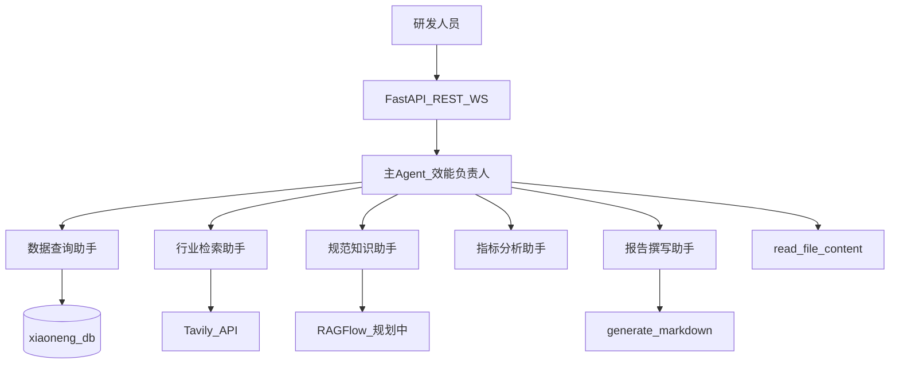

# EfficiencyAgent — 研发效能 Multi-Agent 系统

> 公司内部研发效能助手：自动聚合数据、检索实践、分析指标、生成周报与复盘。

## 项目简介

EfficiencyAgent（效能助手）是一套面向公司研发团队的 Multi-Agent 系统。研发 TL、PM 和效能工程师经常需要从数据库拉取需求、缺陷、迭代等效能数据，结合内部规范与行业实践，手工编写周报和复盘——过程耗时，且容易遗漏关键信息。

本系统由一名「效能负责人」主 Agent 统筹协调五个专家子 Agent，实现：

- 从 `xiaoneng_db` 查询结构化研发效能数据
- 从公网检索研发效能方法论与行业 benchmark
- 读取用户上传的测试报告、Excel 等材料
- 分析指标趋势与异常
- 自动生成周报、迭代复盘与效能分析报告

技术实现基于 DeepAgents + LangGraph 异步编排，通过 FastAPI 提供任务接口与 WebSocket 实时进度推送。项目参考 [`deep_search_pro`](../deep_search_pro) 的**架构模式**，业务场景为原创的「研发效能」领域，适合作为多 Agent 企业落地的学习与面试作品。

## 核心能力

| 能力 | 说明 |
|------|------|
| 效能数据查询 | 只读访问 MySQL `xiaoneng_db`（需求、缺陷、迭代、工时等） |
| 行业实践检索 | 通过 Tavily 搜索研发效能最佳实践与 benchmark |
| 上传材料解读 | 支持 Excel、Markdown、Word、PDF 等文件读取与分析 |
| 内部规范查询 | 对接 RAGFlow 知识库（MVP 阶段占位，V2 正式接入） |
| 指标分析 | 子 Agent 解读数据，发现趋势、异常与对比结论 |
| 报告生成 | 子 Agent 输出周报、迭代复盘、效能分析 Markdown 报告 |

## 架构一览



## 子 Agent 团队

| 子 Agent | 职责 | 数据源 / 工具 | MVP |
|----------|------|---------------|-----|
| 数据查询助手 | 查询需求、缺陷、迭代、工时等结构化数据 | MySQL `xiaoneng_db` | P0 |
| 行业检索助手 | 检索研发效能方法论、行业 benchmark | Tavily | P0 |
| 规范知识助手 | 查询内部研发规范、流程、模板 | RAGFlow | P1（先 stub） |
| 指标分析助手 | 解读查询结果，发现趋势 / 异常 / 对比 | 依赖数据查询助手输出 | P0 |
| 报告撰写助手 | 输出周报、迭代复盘、效能分析报告 | `generate_markdown` / PDF | P0 |

**主 Agent（效能负责人）**：理解用户意图、规划步骤、委派子 Agent、读取上传文件、推送任务进度。

## 技术栈

- **Agent 框架**：DeepAgents 0.4.x + LangChain + LangGraph
- **API 服务**：FastAPI + WebSocket
- **数据层**：MySQL（`xiaoneng_db`）、Tavily、RAGFlow（规划）
- **运行时**：Python 3.11+、asyncio、ContextVar 会话隔离

## 项目文档

- 详细设计见 [docs/PROJECT.md](docs/PROJECT.md)

## 本地启动

> 业务代码实现中，启动步骤将在 Phase 4~5 完成后补充。

```bash
# 1. 安装依赖
pip install -r requirements.txt

# 2. 配置环境变量（参考 .env.example）
cp .env.example .env

# 3. 启动服务（待实现）
uvicorn api.server:app --reload
```

## 目录规划（目标结构）

```
multi-agent-pro/
├── agent/          # 主 Agent + 子 Agent
├── api/            # REST / WebSocket 入口
├── config/         # 集中配置
├── context/        # ContextVar 会话隔离
├── docs/           # 项目文档
├── llm/            # 模型配置
├── prompt/         # Prompt 管理
├── tools/          # 工具层（DB、搜索、文件等）
└── utils/          # 路径、转换等工具
```
