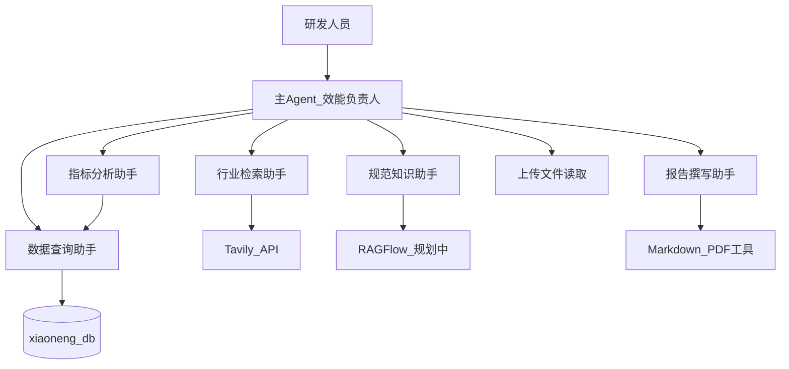

# EfficiencyAgent 项目说明

## 1. 项目定位

**项目名称**：EfficiencyAgent（效能助手）

**一句话**：面向研发团队的 Multi-Agent 系统，自动聚合需求/缺陷/迭代数据、内部规范与外部最佳实践，生成周报、复盘与效能分析报告。

**数据库**：`xiaoneng_db`（效能效能库，存储研发效能相关结构化数据）

---

## 2. 背景与痛点

### 现状问题

1. **数据分散**：需求完成率、缺陷修复时效、迭代吞吐等指标散落在 MySQL 各表中，人工查询拼接效率低。
2. **周报成本高**：研发 TL / PM 每周需手工汇总数据、撰写周报，重复劳动多。
3. **复盘不系统**：迭代复盘往往缺少外部行业对标，难以形成可执行的改进建议。
4. **规范难对照**：内部发布规范、流程文档与实际上线数据之间缺少自动核对手段。

### 解决思路

用 Multi-Agent 架构将「查数、搜实践、读材料、做分析、写报告」拆分为专家子 Agent，由主 Agent 统一调度，用户只需用自然语言描述目标。

---

## 3. 目标用户

| 角色 | 典型诉求 |
|------|----------|
| 研发 TL | 迭代复盘、团队效能周报、缺陷趋势分析 |
| PM | 需求吞吐、交付节奏、风险项汇总 |
| 效能工程师 | 指标异常排查、对标行业实践、规范合规检查 |

---

## 4. 用户故事

| ID | 故事 | 优先级 |
|----|------|--------|
| US-01 | 作为研发 TL，我希望基于本迭代数据和上传的测试报告自动生成复盘文档 | P0 |
| US-02 | 作为 PM，我希望一键生成本周效能周报，含需求与缺陷核心指标 | P0 |
| US-03 | 作为效能工程师，我希望系统能对比行业实践并给出改进建议 | P0 |
| US-04 | 作为研发人员，我希望上传 Excel 后系统能结合库内数据一起分析 | P0 |
| US-05 | 作为 TL，我希望实时看到子 Agent 执行进度 | P0 |
| US-06 | 作为效能工程师，我希望查询内部研发规范并与上线数据核对 | P1 |

---

## 5. 典型场景

### 场景 A — 迭代复盘

**用户输入**：

> 帮我基于本迭代的需求完成率、缺陷数和上传的测试报告，写一份迭代复盘 Markdown。

**Agent 流程**：

```
数据查询助手 → read_file_content（测试报告）→ 指标分析助手 → 报告撰写助手
```

### 场景 B — 效能周报

**用户输入**：

> 生成本周研发效能周报，包含需求吞吐、缺陷修复时效，并参考行业实践给改进建议。

**Agent 流程**：

```
数据查询助手 → 行业检索助手 → 指标分析助手 → 报告撰写助手
```

### 场景 C — 规范查询 + 数据核对

**用户输入**：

> 按公司发布规范检查本周上线需求是否合规，并列出相关需求列表。

**Agent 流程**：

```
规范知识助手 → 数据查询助手 → 主 Agent 汇总回答
```

---

## 6. Agent 编排设计



### 主 Agent — 效能负责人

| 职责 | 说明 |
|------|------|
| 意图理解 | 判断用户需要查数、分析还是写报告 |
| 任务规划 | 生成 todo-list，决定子 Agent 调用顺序 |
| 子 Agent 委派 | 通过 DeepAgents `task` 工具调度专家 |
| 文件读取 | 调用 `read_file_content` 处理上传材料 |
| 进度推送 | 通过 monitor 向前端推送执行状态 |

### 子 Agent 分工

| 子 Agent | 绑定工具 | 输出 |
|----------|----------|------|
| 数据查询助手 | `list_sql_tables`、`get_table_data`、`execute_sql_query` | 结构化查询结果（CSV 格式） |
| 行业检索助手 | `internet_search` | 公网检索摘要 |
| 规范知识助手 | `get_assistant_list`、`create_ask_delete`（RAGFlow） | 内部规范原文（MVP stub） |
| 指标分析助手 | 无外部工具，基于上下文分析 | 趋势、异常、对比结论 |
| 报告撰写助手 | `generate_markdown`、`convert_md_to_pdf` | 周报 / 复盘 / 分析报告文件 |

### 关键执行顺序（Prompt 约束）

1. 必须先完成数据收集（查库 / 搜索 / 读文件），再调用指标分析助手。
2. 分析完成后，才委派报告撰写助手生成文档。
3. 禁止用占位符内容生成报告。

---

## 7. 数据模型预期（xiaoneng_db）

> 具体表结构以实现阶段为准，预期包含以下域：

| 数据域 | 预期表 / 字段示例 |
|--------|-------------------|
| 需求 | 需求 ID、状态、迭代、完成时间、负责人 |
| 缺陷 | 缺陷 ID、严重级别、修复时效、关联需求 |
| 迭代 | 迭代名称、起止日期、计划 / 实际完成数 |
| 工时 | 成员、任务类型、投入工时（可选） |

所有数据库访问均为**只读**（SELECT / SHOW / DESCRIBE），禁止写操作。

---

## 8. MVP 与 V2 边界

### MVP（P0）

- [x] 项目描述与架构定义（本文档）
- [x] 主 Agent + 5 子 Agent（规范知识助手可先 stub）
- [x] MySQL 只读查询 + Tavily + 文件上传
- [x] 周报 / 复盘 Markdown 生成
- [x] FastAPI REST + WebSocket + 任务状态查询
- [x] SQL 安全校验 + 结构化日志 + trace_id

### V2

- RAGFlow 真实接入（规范知识助手）
- PDF 报告导出
- Jira / 飞书 API 对接
- Redis checkpoint 断点续跑
- 完整 API 鉴权与租户隔离

---

## 9. 与 deep_search_pro 的差异

| 维度 | deep_search_pro（课程参考） | EfficiencyAgent（本项目） |
|------|----------------------------|--------------------------|
| 业务 | 空调 / 药品行业研究报告 | 研发效能周报 / 复盘 / 分析 |
| 用户 | 通用分析师 | 研发 TL、PM、效能工程师 |
| 数据库 | pharma_db | xiaoneng_db |
| 子 Agent 数 | 3（DB + 搜索 + RAG） | 5（+ 指标分析 + 报告撰写） |
| 核心产出 | 行业深度报告 | 效能周报、迭代复盘 |
| 关系 | 架构模式参考 | 业务与 Prompt 完全原创 |

**面试表述建议**：

> 我参考了课程项目的 Multi-Agent 编排模式（主 Agent 软调度 + 子 Agent 委派 + FastAPI + WebSocket），但将业务场景原创为研发效能领域，并扩展了指标分析和报告撰写两个专家 Agent，同时补齐了企业级的 SQL 只读、任务状态机和可观测性。

---

## 10. 目标目录结构

```
multi-agent-pro/
├── agent/
│   ├── mainagent/       # 效能负责人 runner
│   └── subagent/        # 5 个子 Agent 配置
├── api/                 # server、monitor、task_store
├── config/              # settings.py
├── context/             # ContextVar 会话隔离
├── docs/
│   └── PROJECT.md       # 本文档
├── llm/                 # 模型实例
├── prompt/
│   ├── loader.py
│   └── prompts.yml      # 效能领域 Prompt
├── tools/               # DB、Tavily、RAG、文件、报告
├── utils/
├── storage/             # 本地文件存储抽象
├── observability/       # 结构化日志
└── tests/
```

---

## 11. 后续实现顺序

1. **Phase 3 基建**：config、context、observability、storage、.gitignore
2. **Phase 4 核心**：prompt（效能域）→ tools → 5 subagent → mainagent runner
3. **Phase 5 API**：task_store、REST、WebSocket
4. **Phase 6~8**：测试、安全硬化、部署文档

详细企业级八阶段计划见 Cursor 计划文档「企业级分步开发流程」。
