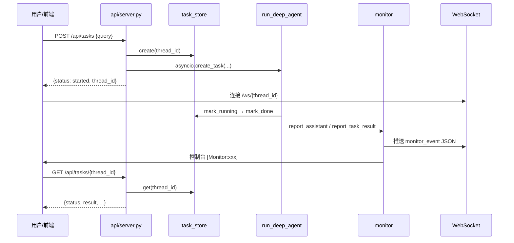

# Phase 5 新增模块学习指南（总览）

> 面向学完 Phase 4（tools → subagent → runner）的同学。  
> 本轮把项目从「只能命令行试跑」升级为「可被前端 / HTTP 调用的服务」。

---

## 一、上线前 vs 上线后

| 维度 | Phase 4 结束时 | Phase 5 新增后 |
|------|----------------|----------------|
| 入口 | `python agent/test_run.py` | 同上 + `uvicorn api.server:app` |
| 任务状态 | 无记录，跑完即忘 | `task_store` 可查 pending/running/done/error |
| 进度推送 | 控制台 `[Monitor:xxx]` | 控制台 + WebSocket 推给前端 |
| LLM 连接 | 依赖环境变量，易 Connection error | 显式 `base_url` + 禁用系统代理 |
| 日志 | 大量 `print` 调试 | `RUNNER_DEBUG` 开关 + 可选 JSON 结构化日志 |

---

## 二、新增文件一览

```
multi-agent-pro/
├── llm/model.py              ← 改造：稳定 LLM 连接
├── config/settings.py        ← 扩展：超时、调试开关
├── api/
│   ├── task_store.py         ← 新增：任务状态机
│   ├── server.py             ← 新增：FastAPI 入口
│   └── monitor.py            ← 扩展：WebSocket 连接管理
├── observability/
│   └── logging.py            ← 新增：结构化日志（可选）
└── agent/mainagent/runner.py ← 改造：对接 task_store + 调试开关
```

各模块详细说明见 [docs/modules/](README.md)。

---

## 三、整体调用链（学习者必看）



**核心思想**：Agent 内核（`runner.py`）不变，外面套一层 **HTTP 壳 + 状态机 + 实时推送**。

---

## 四、与 deep_search_pro 的对应关系

| deep_search_pro | EfficiencyAgent | 说明 |
|-----------------|-----------------|------|
| `api/server.py` | `api/server.py` | 路径几乎一致，多了 `GET /api/tasks/{id}` |
| `api/monitor.py` → `manager` | 同 | `ConnectionManager` + `ToolMonitor` |
| 无 | `api/task_store.py` | 本项目的增强：任务可查询 |
| `agent/llm.py` | `llm/model.py` | 显式 base_url + httpx 配置 |
| 无 | `observability/logging.py` | 企业级可观测性预留 |

---

## 五、本地怎么验证

```bash
# 1. CLI 仍可用
.\.venv\Scripts\python.exe agent\test_run.py

# 2. 启动 API
uvicorn api.server:app --reload --port 8000

# 3. 提交任务
curl -X POST http://localhost:8000/api/tasks ^
  -H "Content-Type: application/json" ^
  -H "X-API-Key: dev-api-key" ^
  -d "{\"query\": \"查 Sprint-12 开放缺陷\"}"

# 4. 查状态（把 thread_id 换成上一步返回的）
curl http://localhost:8000/api/tasks/{thread_id} -H "X-API-Key: dev-api-key"
```

调试 astream 全量输出：`.env` 中设置 `RUNNER_DEBUG=1`。

---

## 六、分模块文档索引

| 文档 | 内容 |
|------|------|
| [01-llm-model.md](01-llm-model.md) | LLM 连接稳定化 |
| [02-config-扩展.md](02-config-扩展.md) | 新增配置项 |
| [03-task-store.md](03-task-store.md) | 任务状态存储 |
| [04-api-server.md](04-api-server.md) | FastAPI 服务 |
| [05-monitor-websocket.md](05-monitor-websocket.md) | 进度监控与 WebSocket |
| [06-observability.md](06-observability.md) | 结构化日志 |
| [07-runner-改造.md](07-runner-改造.md) | runner 如何串联以上模块 |

---

## 七、学完本章你应该能回答

1. 为什么 `POST /api/tasks` 要立刻返回，而不是等 Agent 跑完？
2. `thread_id` 在 ContextVar、checkpoint、WebSocket 里各干什么？
3. `monitor._emit` 如何同时服务 CLI 和前端？
4. `task_store` 为什么用内存而不是 Redis？（MVP 取舍）
5. `trust_env=False` 解决了什么 Windows 环境问题？
