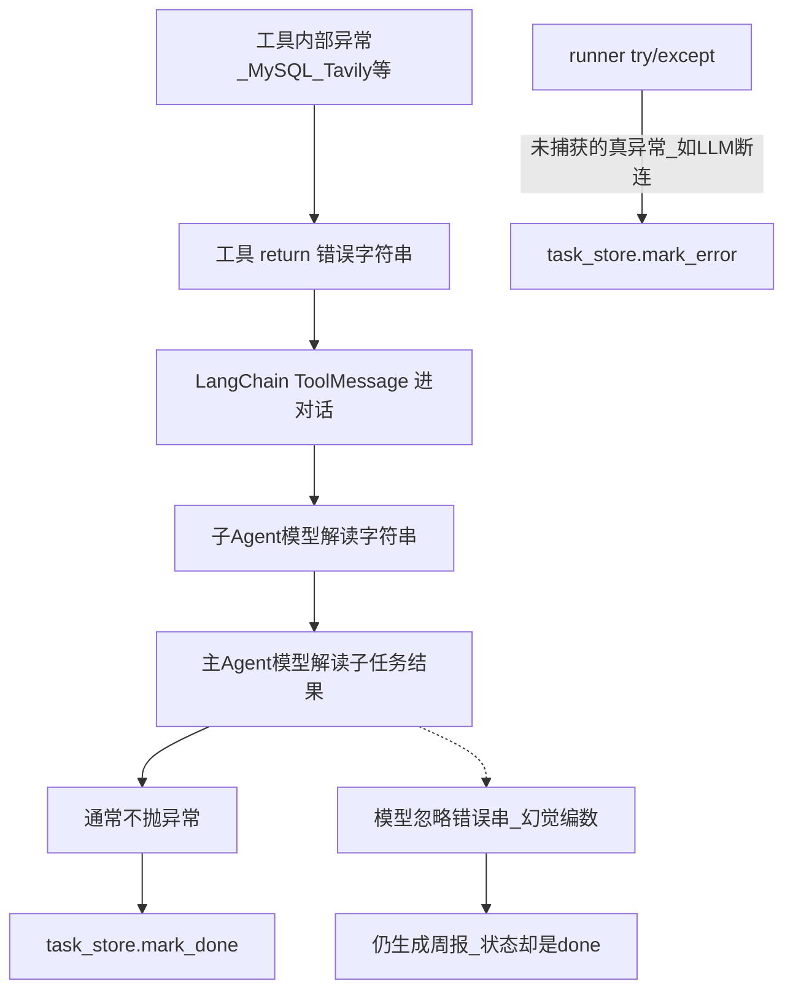

# EfficiencyAgent 面试含金量优化需求文档

| 项 | 内容 |
|----|------|
| 项目 | multi-agent-pro / EfficiencyAgent |
| 文档目标 | 按**代码层级**写清现状（为何如此、落点、异常如何传播、模型不稳时哪里会坏），再写优化点与面试/简历用法 |
| 岗位取向 | Agent 应用开发 / AI 应用后端 |
| 成功标准 | 能扛「刨根问底」；能指文件讲清失败传播链 |
| 关联 | `.cursor/plans/生产级差距评估_91b59cff.plan.md`、`docs/面试项目含金量提升计划.md` |

---

## 1. 背景与目标

### 1.1 为什么要优化

普通 Agent demo：Prompt + Tools，happy path 能跑。面试官会追问例如：

> 如果 Agent 异常了，是全部失败还是只失败那一部分？你怎么做的？为什么？

本项目已有主/子 Agent、异步任务、WS、SQL 校验、ContextVar，**结构优于玩具**；但失败处理是「工具返回错误字符串 + 任务层碰到异常才 mark_error」，**没有显式策略与可观测闭环**，追问时容易露馅。

### 1.2 优化总目标

| 目标 | 说明 |
|------|------|
| G1 | 1～2 个可深挖 10 分钟的差异化亮点（优先：失败隔离） |
| G2 | 失败/超时/安全问题能指代码回答 |
| G3 | 固定 Demo + 故意部分失败可演示 |
| G4 | 每条优化对应可写进简历的表述 |

### 1.3 明确不做

完整 K8s / OIDC / Prometheus 全家桶 / 再堆子 Agent —— 口述升级即可。

---

## 2. 分层现状深挖（代码级 · 为何如此 · 哪里会坏）

> 阅读顺序建议：先看 **2.0 失败传播总图**，再按层下钻。面试深挖时按此链路指代码。

### 2.0 失败传播总图（当前真实行为）



**结论一句话：**  
今天「部分失败」靠的是 **工具不抛异常 + 模型自己读懂错误串**；工程侧**不会**把任务标成 partial，也**不会**在 runner 里判定「搜索挂了但查库成功」。若模型不稳，最坏结果是：**状态显示 done，报告里却是幻觉数据**。

---

### 2.1 工具层（Tool）：为何几乎全是「返回字符串」

#### 2.1.1 设计意图（为什么）

1. **LangChain `@tool` 的契约**：工具函数的返回值会变成对话里的 **ToolMessage.content**，供下一轮 LLM 阅读。返回值必须是模型能读的文本（或可序列化内容），而不是靠抛异常做业务分支。  
2. **图执行稳定性**：若工具抛 `Exception`，可能直接打断 DeepAgents/LangGraph 当前 run，主 Agent 来不及做「换数据源 / 降级写报告」。  
3. 代码注释写明了该策略，例如 [`tools/db_tools.py`](tools/db_tools.py) 文件头：

```14:14:tools/db_tools.py
  - 异常返回字符串而非抛错，避免打断 Agent 流程
```

RAG 同理见 [`tools/ragflow_tools.py`](tools/ragflow_tools.py) 第 6～8 行：未配置时返回友好提示而非抛异常。

#### 2.1.2 各工具实际返回约定（代码落点）

这些字符串**不是统一 schema**，只是人类可读中文前缀；下游没有任何解析器。

| 工具 | 文件 | 失败/降级时返回（示例） | 成功时大致形态 |
|------|------|-------------------------|----------------|
| `list_sql_tables` | `db_tools.py` L53–70 | `"错误：数据库未配置..."` / `"查询出现异常：{e}"` / `"没有可用的表"` | `"可用的表有：a, b, c"` |
| `get_table_data` | `db_tools.py` L80–101 | `"错误：{非法表名}"` / `"查询出现异常：..."` | CSV 风格表头+行 |
| `execute_sql_query` | `db_tools.py` L111–131 | `"错误：{校验失败原因}"` / `"查询出现异常：..."` | CSV + 可能截断提示 |
| `internet_search` | `tavily_tool.py` L38–53 | `"错误：TAVILY_API_KEY 未配置"` / `"网络搜索失败：{e}"` | `str(Tavily结果dict)` |
| `get_assistant_list` | `ragflow_tools.py` L25–42 | `"提示：RAGFlow 尚未接入..."` / `"错误：未安装..."` / `"查询助手异常：..."` | 多行助手描述 |
| `create_ask_delete` | `ragflow_tools.py` L56–74 | `"提示：...无法查询..."` / `"提问失败：..."` | 流式最后一段文本 |
| `read_file_content` | `upload_file_read_tool.py` L42–86 | `"错误：文件不存在..."` / `"错误：不支持的文件格式..."` / `"读取文件出错:..."` | 文件正文或 Excel 摘要 |
| `generate_markdown` | `markdown_tools.py` L43–47 | `"生成Markdown文件失败: ..."` | `"Markdown文件 '...' 已成功生成..."` |
| `convert_md_to_pdf` | `pdf_tools.py` L36–46 | `"错误：文件不存在..."` / `"转换失败: ..."` | word_converter 返回串 |

SQL 校验失败发生在执行前，见 [`sql_validator.py`](tools/sql_validator.py) + `execute_sql_query` L111–113：

```111:113:tools/db_tools.py
    ok, err = validate_readonly_sql(query)
    if not ok:
        return f"错误：{err}"
```

**注意：** 校验拒绝也是 return 字符串，**不会**让任务进入 `error`。

#### 2.1.3 工具层「成功」与「失败」在代码里如何区分

**没有机器可判定的统一字段。** 只能靠：

- 人工看前缀是否像 `错误：` / `网络搜索失败：` / `提示：`；或  
- 指望 LLM「读懂中文错误」。

因此：

| 风险场景 | 发生位置 | 后果 |
|----------|----------|------|
| 模型把 `"查询出现异常：..."` 当成「查过了但没数据」继续写报告 | 子 Agent / 主 Agent 下一轮推理（无代码拦截） | 幻觉指标进 Markdown；`mark_done` |
| 模型收到错误串后**编造一段假 CSV** 再交给分析助手 | 同上 | 分析助手 Prompt 要求「不臆造」，但输入已是假数据时无法自证 |
| 工具返回成功形态但内容是空表 / 截断 | `db_tools.py` L94、L126 | 业务上可能仍该降级，代码一律当成功文本 |
| Tavily 成功返回巨大 `str(dict)` | `tavily_tool.py` L51 | token 膨胀，后续步骤不稳定，但任务仍可能 done |

#### 2.1.4 工具埋点 hooks 与前端进度脱节（易误判「工具失败已上报」）

每个工具开头调用 `hooks.report_tool(...)`，但 [`tools/hooks.py`](tools/hooks.py) 默认实现**只 print**：

```18:19:tools/hooks.py
    def report_tool(self, tool_name: str, args: Optional[Dict[str, Any]] = None) -> None:
        print(f"[Tool] {tool_name} args={args or {}}")
```

注释写「可替换为 monitor」，**当前仓库未替换**（全项目 `from tools.hooks import hooks`，无 `monitor as hooks`）。

因此：

- 前端 WS 上的 `tool_start`，主要来自 [`runner.py`](agent/mainagent/runner.py) 解析 **model 节点的 tool_calls**（见 2.4），是「模型**打算**调工具」，不是「工具**执行结果**成功/失败」。  
- 工具真正失败时的错误字符串，**不会**自动变成 `step_failed` 事件。

---

### 2.2 Prompt / 子 Agent 层：策略写在自然语言里，不是写在代码里

#### 2.2.1 主 Agent（[`prompt/prompts.yml`](prompt/prompts.yml) `main_agent`）

已有约束（L30–36）：

- 先收集再分析再写报告  
- 「未拿到真实数据前不得生成报告」  
- 禁止占位符报告  

**缺失（与失败隔离直接相关）：**

- **未定义**什么叫「真实数据」（是否包含以 `错误：` 开头的 ToolMessage？）  
- **未定义**行业检索失败时是否继续写周报  
- **未定义**规范助手不可用时是否降级  
- **没有** critical / optional 字样  

因此主 Agent「是否继续」完全依赖当次模型理解，**不可回归、不可演示为产品能力**。

#### 2.2.2 各子 Agent Prompt 对失败的覆盖度

| 子 Agent | Prompt 中与失败相关的句子 | 缺口 |
|----------|---------------------------|------|
| 数据查询 | 要求返回完整查询结果（L59） | **未写**「若工具返回错误：应原样上报主 Agent，禁止编造行数据」 |
| 行业检索 | 要求多角度检索（L67–69） | **未写**搜索失败如何收尾 |
| 规范知识 | **有**：若返回「未接入」或异常，告知主 Agent，勿编造（L81） | 仅此助手写清；其它助手不对齐 |
| 指标分析 | 「不臆造数字；数据不足指出缺口」（L96） | 若上游塞了假 CSV，它可能当真实数据分析 |
| 报告撰写 | 「基于真实数据；不得占位符」（L114–118） | 同上；且要求 ≥800 字，模型压力下更易「凑字」 |

#### 2.2.3 模型不稳定时，在本层会怎样坏

DeepAgents 把子 Agent 当 `task` 工具委派；子 Agent 的最终回复是一段自然语言，回到主 Agent。

| 不稳定表现 | 可能出错点 | 为何代码拦不住 |
|------------|------------|----------------|
| 子 Agent 收到 `"网络搜索失败：..."` 却回复「根据行业实践，DORA 精英团队…」并捏造数字 | 行业检索助手输出 → 主 Agent 上下文 | 无 JSON schema / 无引用校验 |
| 子 Agent 把工具错误改写成「库中暂无 Sprint-12 缺陷」 | 数据查询助手输出 | 主 Agent 以为「查过了是零」，与「查询失败」语义不同 |
| 主 Agent 违反顺序：未收集完就调报告撰写 | `prompts.yml` L30–35 仅软约束 | runner **不解析** todo，不强制状态机 |
| 主 Agent 同轮既查数又写报告 | Prompt L35 禁止，模型仍可能违例 | 无代码门禁 |
| `subagent_type` 名称与配置不完全一致 | runner L150–154 只透传字符串到 monitor | 调错助手或调空，表现为「跑了但结果怪」，不一定 mark_error |

---

### 2.3 SQL 校验层（工具前置）：拦写操作，不拦「失败任务」

[`tools/sql_validator.py`](tools/sql_validator.py)：

- 允许多以 SELECT/SHOW/DESCRIBE/EXPLAIN 开头  
- 黑名单写关键字、禁止多语句  
- 表名白名单字符  

**会返回字符串拒绝，例如：** `"错误：仅允许 SELECT / ..."`（经 `execute_sql_query`）。

| 场景 | 行为 | 任务最终状态 |
|------|------|----------------|
| 模型生成 `DELETE FROM ...` | 校验失败 → 错误字符串回模型 | 通常仍可继续跑 → 常为 **done** |
| 模型改写为合法但错误的 SELECT（错表名） | MySQL 异常 → `"查询出现异常：..."` | 同上 |
| 校验被绕过的复杂注入（注释/编码等） | 正则黑名单可能漏 | 应用层不够 → 需只读账号（文档已提醒，代码未强制） |

**面试易混点：** SQL 校验解决的是「别让 Agent 改库」，**不是**「Agent 失败隔离」。

---

### 2.4 Runner / 主图执行层（[`agent/mainagent/runner.py`](agent/mainagent/runner.py)）

#### 2.4.1 成功与失败如何判定（核心）

```202:216:agent/mainagent/runner.py
    try:
        final_result = await _consume_agent_stream(input_messages, config)

        if final_result is not None:
            task_store.mark_done(session_id, final_result, session_dir_str)
            ...
        else:
            task_store.mark_done(session_id, "", session_dir_str)
            ...

    except Exception as e:
        log_error(_logger, "agent_error", str(e), session_id=session_id)
        task_store.mark_error(session_id, str(e))
        monitor._emit("error", f"执行主 Agent 异常: {str(e)}")
        raise
```

含义：

| 情况 | 结果 |
|------|------|
| 工具/子 Agent **软失败**（错误字符串在对话里），图正常跑完，模型产出最终 content | **`mark_done`** |
| 图跑完但没解析到最终 content | 仍 **`mark_done("")`**（L208–210）——空成功 |
| LLM 连接失败、图抛未捕获异常等 | **`mark_error`** + WS `error` + re-raise |

**因此：回答「子 Agent 挂了会不会全挂」——以当前代码为准：工具级挂了通常不全挂；只有变成未捕获异常才全挂。中间没有 partial。**

#### 2.4.2 astream 里实际看了什么、没看什么

[`_consume_agent_stream`](agent/mainagent/runner.py) L132–171：

| 节点 | 处理 | 不处理 |
|------|------|--------|
| `model` + `tool_calls` | `name=="task"` → `monitor.report_assistant`；其它 → `monitor.report_tool` | 不验证 args 合法性 |
| `model` + `content` | 当作最终结果，`report_task_result` | 不检查内容是否含幻觉/是否承认失败 |
| `tools` | **仅 debug 打印**结果预览（L165–169） | **不解析**结果是否以 `错误：` 开头；不记 failed_steps；不改 task 状态 |

所以：**工具返回了 `"网络搜索失败：xxx"`，runner 代码路径上等于「无事发生」。**

#### 2.4.3 ContextVar 清理（做得对的部分）

`setup_request_context` + `finally: reset_all_tokens`（L192–218）保证异常也会清会话上下文，避免串台。这点面试可正面讲；它解决的是**并发隔离**，不是**业务失败隔离**。

#### 2.4.4 Checkpoint

`InMemorySaver()`（L34）：进程内；与失败策略无关，但重启后续跑能力为 0。

---

### 2.5 任务状态层（[`api/task_store.py`](api/task_store.py)）

```15:19:api/task_store.py
class TaskStatus(str, Enum):
    PENDING = "pending"
    RUNNING = "running"
    DONE = "done"
    ERROR = "error"
```

| 能力 | 有无 |
|------|------|
| `partial_success` / `degraded` | 无 |
| `failed_steps` / 步骤列表 | 无 |
| `timeout` / `cancelled` | 无 |
| 持久化 | 无（内存 dict + Lock） |

`GET /api/tasks/{thread_id}`（[`server.py`](api/server.py) L102–107）只能看到上述二元终态。  
**面试官问「怎么看出只失败了一部分」——现状：状态接口看不出来。**

---

### 2.6 API / 后台调度层（[`api/server.py`](api/server.py)）

```62:80:api/server.py
async def _run_task_background(...):
    try:
        await run_deep_agent(...)
    except Exception as exc:
        print(f"[API] Background task failed: ...")  # 仅打印

def _schedule_agent_task(...):
    asyncio.create_task(_run_task_background(...), ...)
```

| 点 | 现状 | 风险 |
|----|------|------|
| 任务超时 | `settings.task_timeout_sec` 存在，**此处未 `wait_for`** | 任务可无限挂起（直到 LLM/工具自己超时或挂死） |
| 取消 | 无 Task 句柄表、无取消 API | 无法回答「用户点取消怎么办」的实现 |
| 异常 | runner 已 mark_error；这里只 print | 可接受，但无线上告警 |
| 并发上限 | 无 | 多请求可打满 LLM 配额 |

上传（L119–126）：`target_dir / file.filename` **未** `Path(name).name`，`../` 可能写出 session 目录外（安全现状见 2.8）。

---

### 2.7 Monitor / WebSocket 层（[`api/monitor.py`](api/monitor.py)）

#### 2.7.1 事件类型（现状能推什么）

| 方法 | event | 含义 |
|------|-------|------|
| `report_session_dir` | `session_created` | 工作目录创建 |
| `report_assistant` | `assistant_call` | 主模型**发起**子 Agent 调用 |
| `report_tool` | `tool_start` | 主模型**发起**工具调用 |
| `report_task_result` | `task_result` | 主模型最终 content |
| `_emit("error", ...)` | `error` | 仅 runner 捕获到异常时 |

**没有：** `tool_end`、`tool_error`、`step_failed`、`degraded`、`partial_success`。

#### 2.7.2 连接模型

`active_connections: Dict[str, WebSocket]`——同一 `thread_id` **单连接**；新连接覆盖旧连接；断线无事件补发。

#### 2.7.3 与 hooks 双轨

- Runner 路径：计划调用 → WS  
- Tool 路径：`hooks` print → **多数进不了 WS**  

面试若说「前端能看到每个工具成败」，**与现状不符**。

---

### 2.8 路径与文件沙箱层（[`utils/path_utils.py`](utils/path_utils.py) + 上传）

#### 2.8.1 `resolve_path` 在做什么

- 剥 `/workspace`、`/mnt/data` 等虚拟前缀（防 LLM 乱写绝对虚拟路径）  
- 相对路径拼到 `session_dir`  
- 含 `updated/` 时解析到上传目录  

#### 2.8.2 未强制「解析后必须在 session 内」

对**已是绝对路径**且带盘符的情况（L59–76），可能 `return str(full_path)` 落在 session 外，**没有**统一的 `is_relative_to(session_dir)` 拒绝。

| 场景 | 位置 | 风险 |
|------|------|------|
| 上传 `../../../evil.txt` | `server.py` L123 | 可能写到 `upload_root` 之外 |
| `generate_markdown` 的 path/filename 含 `..` | `markdown_tools.py` + `resolve_path` | 相对路径通常仍在 session 下；绝对路径分支更危险 |
| 下载 | `server.py` L131–137 | 有 `output` 限制，相对较好 |

---

### 2.9 超时分层现状（配置 vs 接线）

| 层级 | 配置 | 是否接线 | 超时后现象 |
|------|------|----------|------------|
| LLM HTTP | `openai_timeout_sec`（`config/settings.py`，`llm/model.py`） | 是 | 倾向变成 runner 异常 → **整单 error** |
| 单次 SQL/工具 | 无独立超时 | 否 | 慢查询可卡住整图 |
| 整任务 | `task_timeout_sec=600` | **否** | 配置「假存在」，面试若说已做超时会被打脸 |

---

### 2.10 可观测 / 日志层（[`observability/logging.py`](observability/logging.py)）

- 有 `trace_id` / JSON 日志骨架  
- runner 正常路径 `_log` 仅在 `runner_debug` 时写；异常才 `log_error`  
- SQL 有 `[SQL Audit]` print（`db_tools._audit`），未进统一 trace  

**无法**在面试中稳定打开「某次任务 steps 清单」。

---

### 2.11 用具体例子串起来（给面试官讲的「坏例子」）

#### 例子 A：Tavily Key 无效（可选能力失败）

1. `internet_search` → `return "错误：TAVILY_API_KEY 未配置"`（`tavily_tool.py` L39）或 `"网络搜索失败：..."`（L53）  
2. 行业检索子 Agent 收到 ToolMessage；**Prompt 未强制**如何收尾  
3. 主 Agent 可能：继续调分析+写作，或编造行业段  
4. runner 无异常 → **`mark_done`**  
5. WS：可能有过 `assistant_call`（行业检索），**没有**「搜索失败」事件  
6. `GET /api/tasks/xxx`：`status=done` —— **看不出降级**

#### 例子 B：MySQL 挂了且无上传（关键能力失败）

1. `list_sql_tables` → `"查询出现异常：..."` 或未配置错误串  
2. 若模型仍写出「本周缺陷 12 个…」并调用 `generate_markdown` 成功  
3. runner → **`mark_done`**，磁盘上有一份**假报告**  
4. 这是当前架构最危险的语义漏洞：**关键失败被当成成功**

#### 例子 C：LLM 网关 500 / 超时

1. `httpx` 超时或连接错误冒泡  
2. `run_deep_agent` except → **`mark_error`** + `monitor._emit("error")`  
3. 这是少有的「整单失败」路径 —— 与工具软失败路径**不一致**，面试要主动讲清

#### 例子 D：模型不按「字符串协议」发挥

工具层**没有**要求模型返回固定 JSON；协议是「工具 → 模型」单向文本。  
若追问「模型返回了 xxx 字符串会怎样」——需分清角色：

| 谁返回字符串 | 含义 |
|--------------|------|
| **工具**返回 `错误：...` | 设计如此；问题在下游是否识别 |
| **模型**在最终回答里胡写 / 在 tool args 里乱填 | 无 schema 校验；错误 args 进工具后或再返回错误串，或写出坏文件名 |

报告撰写若调用 `generate_markdown(content=很长的幻觉, filename=...)` 且写盘成功 → 工具返回成功句（`markdown_tools.py` L45）→ 主 Agent 以为「报告已生成」→ **done + 坏文件**。

---

### 2.12 现状总结表（按层）

| 层级 | 关键文件 | 当前策略 | 最大漏洞 |
|------|----------|----------|----------|
| 工具 | `tools/*.py` | 异常→字符串，保图继续 | 无统一错误协议；成败靠模型认字 |
| Prompt | `prompt/prompts.yml` | 仅 RAG 写清勿编造 | 主流程无 critical/optional |
| SQL 校验 | `sql_validator.py` | 拒写操作 | 与任务成败无关 |
| Runner | `runner.py` | 仅 Exception→error | 软失败→done；空 content 也 done |
| TaskStore | `task_store.py` | 四态 | 无 partial / steps |
| API | `server.py` | create_task 火忘 | 超时未接线；上传未消毒 |
| Monitor | `monitor.py` | 播报「开始调用」 | 无结果成败；hooks 未接通 |
| 路径 | `path_utils.py` | 虚拟前缀清洗 | 绝对路径未强制沙箱 |
| 日志 | `observability/` | 骨架 | 无步骤级 trace 产物 |

---

## 3. 优化需求明细

每项：**优化提升 / 验收 / 面试与简历**（详细现状见第 2 节，此处不重复）。

---

### R1【P0】多层失败隔离与降级完成（核心差异化）

#### 优化提升

1. **步骤角色**：`critical` vs `optional`（周报：查库/上传为关键；搜索/RAG/PDF 为可选）  
2. **状态**：`partial_success`（或 `done+degraded`）+ `failed_steps[]`  
3. **工具错误结构化**：统一可解析结构（如 JSON 或固定前缀+机器码），runner/主流程可判定，不只靠模型认中文  
4. **Prompt**：与 R1 对齐——可选失败继续并禁止幻觉补齐；关键失败禁止生成「假充实」报告  
5. **Monitor**：`step_failed` / `degraded`；工具结果路径要能上报（打通 hooks↔monitor 或解析 tools 节点）  

#### 验收标准

- [ ] 例子 A 类：搜索失败 → 可有报告 + `partial_success` + 正文承认缺口 + 状态/trace 可见  
- [ ] 例子 B 类：关键数据全无 → `error` 或明确中止，**不出现**带捏造核心指标的成稿  
- [ ] `GET` 任务可区分 done / partial / error  

#### 面试可说

> 工具层继续软失败以免打断图；但必须结构化，并由任务层按 critical/optional 决策。可选失败 → partial_success；关键失败或未捕获基础设施异常 → error。避免「状态 done、内容是幻觉」。

#### 简历可写

- 设计 Multi-Agent **关键/可选路径失败隔离**与 `partial_success` 降级，修复「工具错误字符串仍整单 done」的语义漏洞  
- 工具错误结构化 + 步骤失败追踪，使失败可判定而不只依赖模型读中文错误  

---

### R2【P0】步骤级状态与可展示 Trace

#### 优化提升

1. 记录子 Agent/工具：开始、结束、耗时、成功/失败原因  
2. `trace.json` 落盘或任务 API 返回 `steps`  
3. WS 最近 N 条补发；`tools` 节点结果纳入观测（改变「只打 start」）  
4. 接通 `hooks` → `monitor`，避免双轨  

#### 实现落点（已完成）

| 能力 | 位置 |
|------|------|
| ContextVar Trace 起止 | [`context/trace.py`](../../context/trace.py) |
| hooks start / format end | [`tools/hooks.py`](../../tools/hooks.py)、[`tools/tool_result.py`](../../tools/tool_result.py) |
| 落盘 | `output/session_{id}/trace.json` via [`observability/trace_io.py`](../../observability/trace_io.py) |
| 任务字段 | `task_store.steps` / `trace_path` |
| API | `GET /api/tasks/{id}`、`GET /api/tasks/{id}/trace` |
| WS 补发 | `ConnectionManager` 每线程最近 50 条 |
| 前端 | 右侧「链路 Trace」按钮 + 侧拉栏时间线 |

#### 验收标准

- [x] Trace 含工具成功/失败与 `duration_ms`；失败与 `failed_steps` 一致  
- [x] 面试可打开 `trace.json` 或前端 Trace 面板讲完整链路  
- [x] WS 重连可补发近期进度事件（`replay: true`）

#### 面试 / 简历

- 话术：可解释、可定位是工具失败还是模型规划失败  
- 简历：步骤级 Trace（子 Agent/工具/耗时/错误分类）  

---

### R3【P1】分层超时与任务取消

#### 优化提升

1. 接线 `task_timeout_sec`（`server._run_task_background`）  
2. SQL/工具级超时  
3. `CANCELLED` + Task 句柄 + ContextVar 清理（已有 finally，需与 cancel 配合）  

#### 验收 / 面试 / 简历

- 能演示超时或取消至少一种  
- 讲清三层超时为何不同  
- 简历：长任务分层超时与可取消执行  

---

### R4【P1】工具安全闭环

#### 优化提升

1. 上传 `Path(filename).name` + 扩展名白名单  
2. `resolve_path` 后强制 `is_relative_to(session_dir)`，否则拒绝  
3. SQL 行数/超时；强调只读账号纵深  

#### 验收 / 面试 / 简历

- `../` 上传被拒；非法路径写盘被拒  
- 话术：靠校验器不靠模型自觉  
- 简历：上传消毒 + 会话沙箱 + SQL 只读与结果限制  

---

### R5【P1】失败向 Agent Eval

#### 优化提升

- `evals/`：至少覆盖例子 A、例子 B；断言状态与「禁止幻觉关键指标」  
- happy path 少量即可  

#### 面试 / 简历

- 评测的是降级行为与反幻觉，不是「能跑通」  
- 简历：含失败降级用例的 Agent Eval  

---

### R6【P2】任务状态可恢复

#### 优化提升

- TaskStore → SQLite；口述 Redis 多实例  
- 可选持久化 checkpointer  

#### 面试 / 简历

- 承认曾用内存；升级持久化与恢复语义  

---

### R7【P2】面试包装

#### 优化提升

- README 主 Demo + **故意失败 Demo**（对齐 2.11 例子 A/B）  
- 一页：已实现 / 取舍 / 升级  
- 讲稿与第 2 节代码行为一致（禁止讲稿超前）  

---

### R8【P3】真 RAG + 证据溯源（可选）

- JD 强调再做；报告标注来源 DB/上传/RAG/搜索  

---

## 4. 推荐落地顺序

| 顺序 | 需求 | 理由 |
|------|------|------|
| 1 | R1 | 堵住「软失败却 done / 幻觉成稿」；直接答深挖题 |
| 2 | R2 | 让 R1 可见可演示 |
| 3 | R7 | 固定失败 Demo |
| 4 | R3 | 超时配置不再「假存在」 |
| 5 | R4 | 安全深挖 |
| 6 | R5 | 回归失败策略 |
| 7 | R6 | 可恢复加分 |
| 8 | R8 | 按 JD |

---

## 5. 简历表述对照

| 弱（像玩具） | 强（对齐真实问题） |
|--------------|-------------------|
| 做了多 Agent 聊天 | 主/子 Agent 职责与工具权限拆分；先收集再分析再写作 |
| 工具失败会返回提示 | **曾**用错误字符串保图继续；**现**结构化错误 + critical/optional + partial_success（做成后再写「现」） |
| WebSocket 推送进度 | 步骤级 Trace，能区分「发起调用」与「执行失败」 |
| （无） | 修复「工具已失败但任务 status=done」的语义漏洞 |

---

## 6. 深挖题速查（务必结合第 2 节讲「现状 → 改造」）

| 问题 | 先诚实讲现状（第 2 节） | 再讲改造（R1/R2…） |
|------|-------------------------|---------------------|
| 全挂还是部分挂？ | 工具软失败通常不全挂但标 done；真异常才 error；无 partial | critical/optional + partial_success |
| 怎么知道哪步挂了？ | WS 多是 start；tools 结果 debug 才看；无 failed_steps | trace.json / step 事件 |
| 模型不理错误串怎么办？ | 现状拦不住，会 done+坏报告 | 结构化错误 + 关键路径门禁 + Eval |
| 超时？ | LLM 有；task_timeout 未接线 | 三层超时 + 取消 |
| 防删库？ | sql_validator 拒写；失败仍是字符串 | 校验 + 只读账号 + 沙箱 |

---

## 7. 验收总清单

- [ ] 例子 A、B 行为符合 R1  
- [ ] 可展示含失败步骤的 trace  
- [ ] 超时或取消可演示至少一项  
- [ ] 上传穿越被拒  
- [ ] ≥2 条失败 Eval  
- [ ] README + 简历 + 讲稿与代码一致  

---

## 8. 文档维护

实现后把第 2 节对应「现状」改为「已完成（commit/日期）」；**讲稿不得超前代码**。

---

## 附录 A：故意失败 Demo（实现 R1 后）

1. **可选失败（例子 A）**：无效 Tavily Key → 周报任务 → `partial_success` + 承认无行业实践。  
2. **关键失败（例子 B）**：断 MySQL、无上传 → `error`/中止，无假指标成稿。  

## 附录 B：与生产级差距

鉴权硬化、多实例、完整运维栈等不在本需求并行范围；面试阶段优先堵住第 2 节描述的语义与可观测漏洞。
