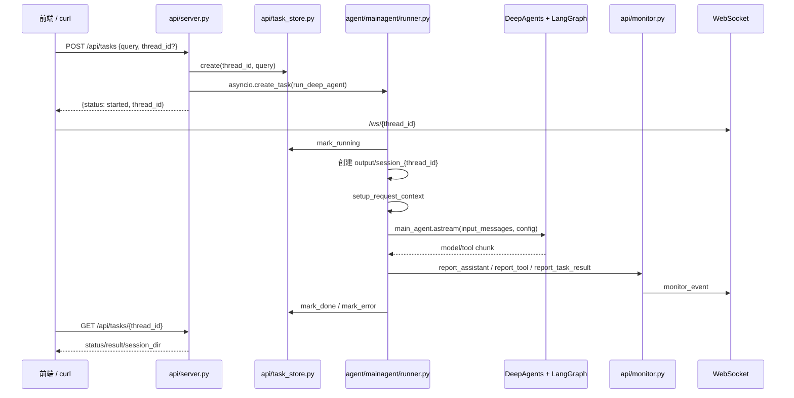
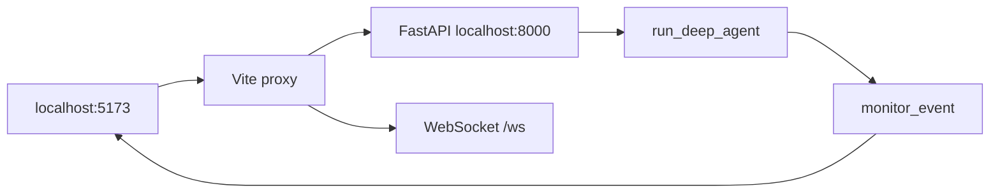

# Multi-Agent-Pro 面试复习深挖讲稿

> 目标：把 `multi-agent-pro` 复习成一套能面试表达的项目故事，而不是只背文件名。
> 默认重点：Python 后端、AI Agent 架构、工程化落地。前端只作为部署调试和联调闭环。

## 1. 项目定位

### 一句话版本

我做的是一个面向研发 TL、PM 和效能工程师的研发效能 Multi-Agent 系统。用户用自然语言提出需求后，系统会自动查 MySQL 里的需求、缺陷、迭代数据，读取上传材料，检索外部最佳实践，再由多个专家 Agent 协作完成指标分析和周报、复盘报告生成。

### 1 分钟版本

这个项目叫 EfficiencyAgent，业务场景是研发团队的效能分析。过去 TL 或 PM 需要手工从数据库查需求完成率、缺陷修复时效、迭代吞吐，再结合测试报告和行业实践写周报或复盘，过程重复且容易漏信息。

我用 Multi-Agent 的方式把任务拆成 5 个专家：数据查询、行业检索、规范知识、指标分析、报告撰写。主 Agent 负责理解用户意图和调度顺序，工具层接 MySQL、Tavily、RAGFlow、文件读取和 Markdown/PDF 生成。服务层用 FastAPI 暴露 REST 和 WebSocket，长任务通过 `thread_id` 异步执行，前端能实时看到子 Agent 和工具执行进度。

项目重点不是简单调用大模型，而是把 Agent 编排、异步任务、会话隔离、SQL 只读安全、文件路径安全和前后端联调做成一个完整闭环。

### 3 分钟版本

这个项目的背景是研发效能数据分散：需求、缺陷、迭代和工时在 MySQL 里，测试报告可能是 Excel、Markdown 或 PDF，行业 benchmark 需要公网检索，内部规范未来还要接 RAGFlow。人工整理这些信息成本高，而且报告质量不稳定。

我的设计是主 Agent 加专家子 Agent。主 Agent 是“效能负责人”，负责识别用户到底是查数、分析、写周报、做复盘还是做规范核对。它不直接包办所有事情，而是通过 DeepAgents 的 `task` 工具委派给 5 个子 Agent：

- 数据查询助手：绑定 `list_sql_tables`、`get_table_data`、`execute_sql_query`，只查 `xiaoneng_db`。
- 行业检索助手：绑定 `internet_search`，检索 DORA 指标、缺陷 SLA、敏捷实践等公开信息。
- 规范知识助手：绑定 RAGFlow 工具，MVP 阶段未配置时会如实返回未接入。
- 指标分析助手：不绑定外部工具，只基于已有上下文分析趋势、异常和建议。
- 报告撰写助手：绑定 `generate_markdown` 和 `convert_md_to_pdf`，负责落盘报告。

执行链路上，前端或 curl 调 `POST /api/tasks` 后，后端不会等待 Agent 跑完，而是创建 `thread_id`，写入 `task_store`，然后用 `asyncio.create_task` 后台执行 `run_deep_agent`。runner 会创建 `output/session_{thread_id}` 工作目录，复制上传文件，设置 ContextVar 上下文，再调用 LangGraph/DeepAgents 的 `astream`。当模型发起工具调用或子 Agent 调用时，runner 解析 chunk，通过 `monitor` 推送事件到 WebSocket；任务完成后写入 `task_store.mark_done`，前端也可以轮询 `GET /api/tasks/{thread_id}`。

工程化上我重点做了几件事：SQL 只允许 `SELECT / SHOW / DESCRIBE / EXPLAIN`，禁止多语句和危险关键字；文件读写都通过 ContextVar 里的会话目录和 `resolve_path` 控制；下载和文件列表接口限制只能访问 `output`；配置集中在 `settings.py`，LLM client 显式设置 `base_url` 并用 `trust_env=False` 避免 Windows 代理干扰。这些是为了让 Agent 项目不只是 demo，而是具备企业落地的安全边界。

### 8 分钟版本结构

面试中如果有时间，可以按这个顺序展开：

1. 业务痛点：研发效能数据分散、报告人工成本高、复盘缺少外部对标。
2. 架构选择：用 Multi-Agent 把查数、搜索、读文件、分析、写报告拆成专家能力。
3. 后端服务：FastAPI 提供任务提交、状态查询、上传、下载和 WebSocket。
4. 长任务设计：`thread_id + task_store + asyncio.create_task + WebSocket`。
5. Agent 执行：`run_deep_agent` 创建工作目录、设置 ContextVar、调用 `main_agent.astream`。
6. Prompt 约束：先收集数据，再分析，再写报告，禁止占位符和未拿到数据就生成文档。
7. 安全边界：SQL 只读校验、表名白名单、路径限制、上传大小限制、API Key。
8. MVP 取舍：内存状态和 InMemory checkpoint 够演示，生产可换 Redis、持久任务表、多租户鉴权和真实 RAGFlow。

## 2. 核心调用链

### 总链路



### `thread_id` 的三重作用

- 任务状态 key：`api/task_store.py` 里用它记录 `pending / running / done / error`。
- WebSocket 路由 key：`api/monitor.py` 的 `ConnectionManager.active_connections` 用它找到对应连接。
- LangGraph checkpoint key：`runner.py` 里传入 `config = {"configurable": {"thread_id": session_id}}`，让同一个会话有独立 checkpoint。

面试回答：

> 我把 `thread_id` 设计成贯穿全链路的会话标识。它既是后端任务状态的主键，也是 WebSocket 定向推送的路由键，同时还是 LangGraph checkpoint 的会话 key。这样 HTTP 请求、后台 Agent 执行、前端实时进度和生成文件目录都能绑定到同一个任务。

### 为什么 `POST /api/tasks` 立即返回

Agent 任务可能运行 1 到 10 分钟，HTTP 连接不适合一直阻塞等待。`api/server.py` 的 `_start_task` 只做三件事：

1. 生成或接收 `thread_id`。
2. `task_store.create(thread_id, query)` 记录任务。
3. `asyncio.create_task(_run_task_background(...))` 后台执行，然后立刻返回 `{status: "started", thread_id}`。

面试回答：

> 长任务如果直接阻塞 HTTP，会遇到网关超时、浏览器等待体验差和无法展示中间进度的问题。所以我把提交任务和执行任务解耦：提交接口只创建任务并返回 `thread_id`，真正执行放到后台协程；客户端通过 WebSocket 收进度，也可以轮询状态接口拿最终结果。

## 3. Agent 编排与 Prompt

### 主 Agent

主 Agent 在 `agent/mainagent/runner.py` 中通过 `create_deep_agent` 组装：

- `model`：来自 `llm/model.py`。
- `system_prompt`：来自 `prompt/prompts.yml` 的 `main_agent.system_prompt`。
- `tools`：主 Agent 直接持有 `read_file_content`，用于读取用户上传材料。
- `subagents`：来自 `agent/subagent/__init__.py` 的 `ALL_SUBAGENTS`。
- `checkpointer`：MVP 使用 `InMemorySaver`。

主 Agent 的职责不是自己写 SQL、自己写报告，而是做任务规划和委派：

- 判断任务类型：纯问答、效能周报、迭代复盘、规范核对。
- 按顺序委派：先数据收集，再指标分析，再报告撰写。
- 把工作目录规则传给子 Agent。
- 在 `astream` 中把子 Agent 和工具调用转成 monitor 事件。

### 5 个子 Agent 的拆分理由

| 子 Agent | 解决的问题 | 为什么单独拆 |
|----------|------------|--------------|
| 数据查询助手 | 查 `xiaoneng_db` 的需求、缺陷、迭代、工时 | SQL 能力和安全约束独立，输出结构化数据 |
| 行业检索助手 | 检索 DORA、缺陷 SLA、敏捷实践 | 外部信息源和数据库查询边界不同 |
| 规范知识助手 | 查询内部研发规范 | RAGFlow 可独立接入，MVP 未接入时可降级 |
| 指标分析助手 | 解读数据、找趋势和风险 | 不给外部工具，避免分析阶段乱查或编造 |
| 报告撰写助手 | 生成 Markdown/PDF | 文件落盘能力集中管理，确保报告基于已分析结果 |

面试回答：

> 我没有把所有工具都塞给一个 Agent，因为那样很容易出现工具选择混乱、执行顺序不可控和职责边界不清。这个项目里查数、搜索、分析、写报告的输入输出差异很大，所以我拆成专家子 Agent，由主 Agent 软调度。这样既符合人类团队协作模型，也方便在 Prompt 里约束“先收集数据，再分析，再写报告”。

### Prompt 里的关键约束

`prompt/prompts.yml` 里最重要的不是文案，而是执行规则：

- 先完成数据收集：数据库、搜索、规范查询、上传文件读取。
- 有定量数据时，必须先调用指标分析助手。
- 用户明确要求生成文档时，必须委派报告撰写助手，主 Agent 不直接写文件。
- 未拿到真实数据前不得生成报告。
- 查数/搜索和写报告不要放在同一次 tool calls 中。
- 复杂任务先列 todo-list。

面试回答：

> Agent 项目很大的问题是模型容易跳步骤，比如还没查到数据就开始写报告。我在主 Prompt 中显式写了执行顺序，并且把分析和写报告拆成不同子 Agent。这样主 Agent 先收集事实，再调用分析助手产出结论，最后才调用写作助手落盘，降低了占位符报告和幻觉数字的概率。

## 4. Runner 执行引擎

`run_deep_agent(task_query, session_id)` 是 CLI 和 HTTP 共用的唯一执行入口。

核心步骤：

1. 如果任务不存在，创建任务记录；然后 `mark_running`。
2. `_prepare_session` 创建 `output/session_{thread_id}`。
3. 如果 `updated/session_{thread_id}` 有上传文件，复制到本次输出工作目录。
4. `setup_request_context(session_dir, thread_id)` 设置 ContextVar。
5. `monitor.report_session_dir` 推送工作目录已创建。
6. 构造工作目录指令，拼进用户输入。
7. `async for chunk in main_agent.astream(...)` 读取 LangGraph 流式执行过程。
8. 如果 model chunk 中有 `tool_calls`：
   - `name == "task"`：说明在调用子 Agent，推送 `assistant_call`。
   - 其他 name：说明调用普通工具，推送 `tool_start`。
9. 如果 model chunk 中有最终 content：推送 `task_result`。
10. 正常结束 `mark_done`，异常时 `mark_error` 并推送 `error`。
11. `finally` 中 `reset_all_tokens(tokens)` 清理 ContextVar。

面试回答：

> 我把 runner 做成单一执行入口，这样 CLI 调试和 API 调用不会有两套 Agent 逻辑。API 只是负责创建任务和后台调度，真正的会话目录、ContextVar、astream 解析、状态更新和进度推送都在 runner 里统一处理。

## 5. WebSocket 进度推送

### Monitor 的职责

`api/monitor.py` 有两个核心类：

- `ToolMonitor`：业务侧只调用 `report_tool`、`report_assistant`、`report_task_result`、`report_session_dir`。
- `ConnectionManager`：维护 `thread_id -> WebSocket` 映射。

`monitor._emit` 会组装统一 JSON：

```json
{
  "type": "monitor_event",
  "event": "assistant_call",
  "message": "正在调用助手: 数据查询助手",
  "data": {},
  "thread_id": "xxx",
  "timestamp": "2026-07-29T..."
}
```

### 事件循环处理

`ConnectionManager.set_loop` 在 FastAPI startup 时保存主事件循环。`monitor._emit` 推送时会判断当前 loop：

- 如果当前 loop 就是 FastAPI loop，直接 `create_task(send_to_thread(...))`。
- 如果是其他线程或没有 running loop，用 `asyncio.run_coroutine_threadsafe` 投递到 FastAPI loop。

面试回答：

> WebSocket 推送不能随便在任意线程 await，所以我在应用启动时保存 FastAPI 的事件循环。monitor 推送时先判断当前事件循环，如果同 loop 就直接 create_task，如果跨线程就用 run_coroutine_threadsafe 投递。这能避免后台任务和 WebSocket 发送之间的事件循环错配。

### 当前 MVP 取舍

当前 `active_connections` 是 `Dict[str, WebSocket]`，一个 `thread_id` 只保留一个连接。面试中可以主动说：

> MVP 默认一个任务一个前端页面，所以 `thread_id` 只映射单个 WebSocket。生产如果支持多标签页或多人协作，可以改成 `Dict[str, Set[WebSocket]]`，断开时清理集合，并增加心跳和重连后的历史事件补发。

## 6. 工具层与安全边界

### SQL 只读安全

数据库工具在 `tools/db_tools.py`，SQL 校验在 `tools/sql_validator.py`。

保护点：

- `execute_sql_query` 调用前先 `validate_readonly_sql`。
- 只允许 `SELECT / SHOW / DESCRIBE / DESC / EXPLAIN` 开头。
- 禁止 `INSERT / UPDATE / DELETE / DROP / ALTER / CREATE / TRUNCATE / GRANT / CALL` 等危险关键字。
- 禁止多语句，避免 `SELECT ...; DROP ...`。
- `get_table_data` 的表名只允许字母、数字、下划线。
- 查询结果最多返回 100 行，避免上下文过大。
- 每次查询打印 SQL audit，包含工具名、耗时、结果大小和 SQL 前缀。

面试回答：

> LLM 生成 SQL 不可信，所以我做了应用层只读校验：限制语句类型、拦截危险关键字、禁止多语句、表名白名单。更重要的是，生产还应该配只读数据库账号，因为应用层校验是第一道防线，不应该是唯一防线。

### 文件读写隔离

文件读取工具 `read_file_content` 支持 `.md / .txt / .docx / .pdf / .xlsx / .xls`，不支持任意二进制。

路径处理链路：

- API 上传文件到 `updated/session_{thread_id}`。
- runner 启动任务时复制上传文件到 `output/session_{thread_id}`。
- `setup_request_context` 把当前 `session_dir` 写入 ContextVar。
- 工具通过 `get_session_context()` 拿目录，而不是让 LLM 传绝对路径。
- `utils/path_utils.py` 清洗 `/workspace`、`/mnt/data` 等虚拟路径，并把相对路径拼到 session 目录。

面试回答：

> 我不让模型直接控制绝对路径。每个任务都有独立的 `output/session_{thread_id}`，工具通过 ContextVar 获取当前工作目录，再用统一的 `resolve_path` 解析相对路径。这样上传文件、生成报告和下载文件都能被限制在当前任务目录或 `output` 根目录下。

### ContextVar 为什么必要

FastAPI 是异步并发，同一个线程里可能同时跑多个任务。普通全局变量会串台，`threading.local` 对 asyncio 也不合适。

项目里 `context/session.py` 存了：

- `session_dir`：工具读写文件用。
- `thread_id`：monitor 推送和 checkpoint 用。
- `trace_id`：结构化日志关联用。
- `user_id`：MVP 默认 anonymous，后续鉴权后可接入真实用户。

面试回答：

> ContextVar 是为 asyncio 场景设计的协程级上下文。每个 Agent 任务执行前设置自己的 `session_dir` 和 `thread_id`，工具层不用层层传参就能拿到当前会话信息。runner 在 `finally` 里 reset token，防止上下文污染下一个任务。

### 配置中心与 LLM 连接

`config/settings.py` 用 `pydantic-settings` 从项目根目录 `.env` 加载配置：

- API：`API_KEY`、`CORS_ORIGINS`。
- LLM：`OPENAI_BASE_URL`、`OPENAI_API_KEY`、`OPENAI_MODEL`、`OPENAI_TIMEOUT_SEC`。
- 数据源：MySQL、Tavily、RAGFlow。
- 业务限制：上传大小、任务超时、输出目录。

`llm/model.py` 亮点：

- 显式传 `base_url` 和 `api_key`，不只依赖环境变量。
- 使用 `httpx.Client(trust_env=False)` 和 `AsyncClient(trust_env=False)`，避免 Windows 系统代理导致连接异常。

面试回答：

> 我把配置集中到 `settings.py`，避免各模块直接 `os.getenv`。LLM 初始化时显式传 base_url、key 和 timeout，并关闭系统代理继承，这主要是为了解决 Windows 开发环境里 httpx 误走系统代理导致的连接问题。

## 7. 前端联调最小掌握

前端项目是 `data-agent-fronted/data-agent-fronted`，只需要掌握部署调试链路。

### 必看文件

- `src/api/client.js`：封装 REST API，统一加 `X-API-Key`。
- `src/utils/ws.js`：连接 `/ws/{thread_id}`，onopen 后 resolve，避免任务先于 WS 注册。
- `vite.config.js`：代理 `/api`、`/health`、`/ws` 到 `http://localhost:8000`。
- `DEPLOYMENT.md`：本地联调步骤。

### 联调链路



### 前端关键点

- `VITE_API_KEY` 必须和后端 `.env` 的 `API_KEY` 一致，默认都是 `dev-api-key`。
- `verifyBackend()` 先请求 `/health`，再用 `/api/tasks/__auth_probe__` 判断 API Key。
- `createTask()` 调 `POST /api/tasks`。
- `getTask()` 调 `GET /api/tasks/{thread_id}`。
- `uploadFiles()` 用 `FormData` 上传文件和 `thread_id`。
- WebSocket URL 基于当前 host：开发时浏览器连的是 Vite，Vite 再代理到后端。
- WebSocket 必须先连接成功，再提交任务，否则可能错过前几个 monitor 事件。

面试回答：

> 前端不是这个项目的重点，我主要用它验证前后端闭环。Vite 把 `/api`、`/health` 和 `/ws` 代理到后端 8000，所以浏览器只访问 5173。API client 统一带 `X-API-Key`，WebSocket 在 onopen 后才允许提交任务，避免任务开始执行时后端还没有注册连接。

## 8. 本地演示脚本

### 后端启动

```powershell
cd F:\BaiduNetdiskDownload\alLearn\multi-agent-pro
.\.venv\Scripts\Activate.ps1
uvicorn api.server:app --reload --host 0.0.0.0 --port 8000
```

健康检查：

```powershell
curl http://localhost:8000/health
```

提交任务：

```powershell
curl -X POST http://localhost:8000/api/tasks `
  -H "Content-Type: application/json" `
  -H "X-API-Key: dev-api-key" `
  -d "{\"query\":\"帮我总结 Sprint-12 的开放缺陷并给改进建议\"}"
```

查询状态：

```powershell
curl http://localhost:8000/api/tasks/{thread_id} -H "X-API-Key: dev-api-key"
```

### 前端启动

```powershell
cd F:\BaiduNetdiskDownload\alLearn\data-agent-fronted\data-agent-fronted
npm run dev
```

访问：

```text
http://localhost:5173
```

演示时可以按这个顺序讲：

1. 先展示后端 `/health`。
2. 打开前端，确认后端连接状态。
3. 可选上传一份 Markdown 或 Excel。
4. 提交任务。
5. 看步骤条中的 `session_created`、`assistant_call`、`tool_start`、`task_result`。
6. 说明最终报告保存在 `output/session_{thread_id}`。

## 9. 高频追问与回答

### 1. 为什么用 Multi-Agent，而不是一个 Agent 加很多工具？

因为任务天然有不同专家边界：查库、搜索、分析、写报告的工具、输入输出和风险都不同。拆成子 Agent 后，每个 Agent 的 Prompt 更聚焦，工具权限更小，主 Agent 只负责规划和调度，整体更可控。

### 2. 这个项目和课程参考项目有什么差异？

我参考的是主 Agent 软调度、子 Agent 委派、FastAPI 和 WebSocket 的架构模式，但业务换成了原创的研发效能场景。相比参考项目，我扩展了指标分析和报告撰写两个专家 Agent，并补了 SQL 只读、任务状态机、ContextVar 会话隔离和可观测性。

### 3. 为什么任务接口不直接返回结果？

Agent 是长任务，直接阻塞 HTTP 容易超时，也不能展示中间进度。这里用异步任务模式：提交后返回 `thread_id`，后台执行，前端通过 WebSocket 看进度，通过状态接口拿结果。

### 4. `task_store` 为什么用内存？

这是 MVP 取舍。本地演示和面试作品中，内存状态足够表达状态机设计，复杂度低。生产环境应换 Redis 或数据库，支持服务重启恢复、任务历史查询和多实例部署。

### 5. `thread_id` 到底解决什么问题？

它把一次用户任务贯穿起来：API 创建状态、runner 设置上下文、WebSocket 定向推送、LangGraph checkpoint、输出目录命名都依赖同一个 `thread_id`。

### 6. WebSocket 怎么保证推给正确用户？

前端连接 `/ws/{thread_id}`，后端 `ConnectionManager` 保存 `thread_id -> WebSocket`。runner 执行时 ContextVar 里有当前 `thread_id`，monitor 推送时只发给对应连接。

### 7. 如果 WebSocket 断了怎么办？

MVP 中断开后就没有实时事件，但任务仍在后台跑，最终结果可以通过 `GET /api/tasks/{thread_id}` 轮询获取。生产可以增加事件持久化、断线重连、历史事件补发和心跳检测。

### 8. 为什么要用 ContextVar？

FastAPI 异步并发下，全局变量会被多个协程共享，容易串台。ContextVar 能提供协程级上下文，让工具层不用显式传参也能拿到当前任务的 `session_dir` 和 `thread_id`，并在 `finally` 清理。

### 9. SQL 安全怎么做？

`execute_sql_query` 执行前经过 `validate_readonly_sql`，只允许只读语句，禁止危险关键字和多语句。`get_table_data` 还校验表名，只允许字母数字下划线。生产还应配只读数据库账号做第二层防线。

### 10. 如何避免 Agent 编造数据？

Prompt 明确要求先查库、搜索或读文件，再调用指标分析助手，最后才允许报告撰写助手生成文件。指标分析助手不绑定外部工具，只基于已有数据分析，并要求数据不足时说明缺口。

### 11. 上传文件怎么隔离？

上传先进入 `updated/session_{thread_id}`，runner 执行时复制到 `output/session_{thread_id}`。工具读取文件时从 ContextVar 获取当前会话目录，不依赖模型传绝对路径，并且限制文件扩展名。

### 12. 文件下载如何防目录遍历？

`/api/download` 和 `/api/files` 会先 `Path(path).resolve()`，再检查目标路径是否在 `output_dir.resolve()` 下，不在就返回 403。这样即使传 `../` 也不能下载 output 外的文件。

### 13. 为什么 `llm/model.py` 要设置 `trust_env=False`？

Windows 开发环境经常有系统代理，httpx 默认可能继承代理配置导致连接中转或 OpenAI compatible endpoint 失败。显式 `trust_env=False` 可以让 LLM 请求走直连配置，更稳定。

### 14. RAGFlow 没接入时怎么办？

规范知识工具检查 `.env` 中的 `RAGFLOW_API_URL` 和 `RAGFLOW_API_KEY`。未配置时返回友好提示，不抛异常、不编造规范。MVP 能演示架构占位，V2 再接真实知识库。

### 15. 生产化你会怎么改？

我会优先做 5 件事：任务状态从内存换 Redis/数据库；增加任务超时和取消；WebSocket 支持多连接和断线补发；RAGFlow 真实接入并做权限控制；API Key 升级为用户鉴权和租户隔离。

## 10. 多天复习安排

### Day 1：讲清项目

目标：能在 3 分钟内讲完整项目背景、架构和亮点。

复习内容：

- `docs/PROJECT.md`
- 本文第 1、2、3 节
- 画一遍核心调用链

验收：

- 不看代码说出 5 个子 Agent 的职责。
- 说清和参考项目的区别。
- 说清 `thread_id` 三重作用。

### Day 2：吃透后端执行链路

目标：能解释请求进来后每一步发生什么。

复习内容：

- `api/server.py`
- `api/task_store.py`
- `api/monitor.py`
- `agent/mainagent/runner.py`

验收：

- 能解释为什么 `asyncio.create_task`。
- 能解释 `astream` chunk 怎么转成进度事件。
- 能解释 `mark_running / mark_done / mark_error` 状态流转。

### Day 3：吃透 Agent 与工具边界

目标：能回答 Agent 设计和安全追问。

复习内容：

- `prompt/prompts.yml`
- `agent/subagent/*.py`
- `tools/db_tools.py`
- `tools/sql_validator.py`
- `tools/upload_file_read_tool.py`
- `tools/markdown_tools.py`
- `utils/path_utils.py`

验收：

- 能解释为什么分析助手没有工具。
- 能解释如何避免未查数据就写报告。
- 能解释 SQL 和路径安全边界。

### Day 4：工程化与联调

目标：能现场启动并说明前后端如何协作。

复习内容：

- `config/settings.py`
- `context/session.py`
- `llm/model.py`
- `observability/logging.py`
- 前端 `src/api/client.js`
- 前端 `src/utils/ws.js`
- 前端 `vite.config.js`
- 前端 `DEPLOYMENT.md`

验收：

- 能现场说出后端和前端启动命令。
- 能解释 API Key 不一致时为什么是 401。
- 能解释 WebSocket 为什么要先连接再提交任务。

### Day 5：模拟面试

目标：把技术点变成自然表达。

练习方式：

- 先用 1 分钟版本开场。
- 再根据面试官追问切换到对应模块。
- 每个回答都尽量包含：问题、设计、代码落点、取舍。

验收：

- 15 个高频问题能连续答完。
- 能主动说出 2 到 3 个生产化改进。
- 能把项目讲成“业务价值 + 技术落地”，而不是只列技术栈。

## 11. 最推荐背下来的三段话

### 项目亮点

这个项目的亮点是把研发效能分析做成了一个可运行的 Multi-Agent 系统。它不是简单聊天，而是能查结构化数据库、读用户上传文件、检索外部实践、分析指标并生成报告。后端用 FastAPI 承接长任务，WebSocket 实时推送子 Agent 和工具执行进度，工具层还做了 SQL 只读和路径隔离。

### 核心难点

核心难点是长任务和多会话隔离。Agent 执行时间不稳定，所以 HTTP 接口不能阻塞等待。我用 `thread_id` 串起任务状态、WebSocket 推送、LangGraph checkpoint 和输出目录；runner 里用 ContextVar 保存当前会话的目录和任务 ID，工具层就能在异步并发下安全读写当前任务文件。

### 工程化取舍

这个版本是 MVP，所以任务状态和 checkpoint 都用内存实现，便于本地演示和快速迭代。但安全和扩展边界已经预留了：SQL 只读校验、API Key、CORS、上传大小限制、output 路径限制、结构化日志和 RAGFlow stub。生产化时可以把状态迁到 Redis/数据库，引入真正的用户鉴权、任务取消、断线补发和多实例部署。

