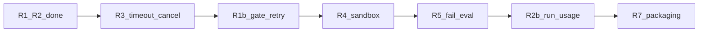

# 面试补齐迭代待办（可勾选）

> **目标**：R1/R2 之后，按轮次补齐压力题缺口，面试能 Demo、能讲清边界。  
> **深度**：面试够用。不做完整 OTel、不做真暂停/恢复演示、不做重 RAG。  
> **用法**：任选一轮实现；做完勾选，并更新 [面试压力题速查-R1R2之后.md](Agent 压力面试题完整分类.md) 底气列。

配套：[面试压力题速查](Agent 压力面试题完整分类.md) · [需求总册](./面试含金量优化需求文档.md) · [迭代学习索引](./迭代学习索引.md)

---

## 总览

| 顺序 | 轮次 | 挡哪些压力题 | 状态 |
|------|------|--------------|------|
| 0 | R1 / R2 | 失败继续、Trace、WS vs Trace、子图不可见 | 已完成 |
| 1 | R3 超时与取消 | #4 #5 | **已完成** |
| 2 | R1b 成稿门禁 + 禁重试 | #2 #3 #22 | **已完成** |
| 3 | R4 安全沙箱 | #13 #14（#18 部分） | 待做 |
| 4 | R5 失败向 Eval | #17 | 待做 |
| 5 | R2b 轻量 run_id/用量 | #8；#9 #24 轻量版 | 待做 |
| 6 | R7 面试包装 | Demo/讲稿对齐；标明未做项 | 待做 |

建议顺序：R3 → R1b → R4 → R5 → R2b → R7。可跳着做，但 R5 最好在 R1b 之后（断言依赖门禁）。

---

## 已完成（勿重复造）

- [x] **R1** 结构化软失败 + critical/optional → `error` / `partial_success` / `done`
- [x] **R2** 步骤 Trace 落盘 + API + 右侧侧拉栏
- [x] 压力题速查一页、R1/R2 学习指南
- [x] **R1b** 成稿门禁 + `retryable=false` 同工具短路（见 [迭代-R1](./迭代-R1-失败隔离学习指南.md) §9）
- [x] **R3** 任务超时/取消（见 [迭代-R3-超时与取消学习指南.md](./迭代-R3-超时与取消学习指南.md)）

---

## R3：分层超时与任务取消

**挡题**：工具/模型/任务超时怎么做？超时后状态与 Context 清理？

**关键落点**：

- [x] `api/task_store.py`：状态 `TIMEOUT`、`CANCELLED`；`mark_timeout` / `mark_cancelled`
- [x] `api/server.py`：`thread_id → Task` 句柄；`asyncio.wait_for` 接 `settings.task_timeout_sec`
- [x] `POST /api/tasks/{id}/cancel`
- [x] `agent/mainagent/runner.py`：区分取消/超时与业务 error；Trace `status` 终态
- [x] 前端：超时/取消文案；running 时「取消」按钮
- [x] 测试：短超时 + cancel 状态断言
- [x] 文档：`docs/迭代-R3-超时与取消学习指南.md`；速查 #4 #5 → ✅

**面试口径**：三层——LLM HTTP 超时（已有）/ 工具侧（可后补）/ 整任务（本轮接线）。

---

## R1b：成稿门禁 + 同工具禁重试

**挡题**：可选失败会不会幻觉成稿？为何同工具调两次？关键失败为何还有长报告？

**关键落点**：

- [x] `generate_markdown`：已有 critical 失败则拒绝写充实报告，返回结构化 error
- [x] ContextVar：`retryable=false` 同工具再次调用 → 短路（不二次连库）；Trace 可标 `short_circuited_retry`
- [x] Prompt 一句对齐
- [x] 单测：门禁 + 短路
- [x] 文档：R1 指南「R1b 补丁」；速查 #2 #3 #7 #8

---

## R4：工具安全闭环

**挡题**：上传 `../`？路径逃逸？SQL 纵深？

**关键落点**：

- [ ] 上传：`Path(filename).name` + 扩展名白名单
- [ ] `utils/path_utils.py`：resolve 后强制相对 `session_dir`，否则拒绝
- [ ] SQL：现有 validator +（可选）结果行数上限
- [ ] 测试：`../` 上传 400；越狱路径失败
- [ ] 文档 R4；速查 #13 #14

---

## R5：失败向 Agent Eval

**挡题**：怎么证明失败策略没回归？

**关键落点**：

- [ ] `evals/` 或 `tests/evals/`：搜索失败 → `partial_success`；库失败 → `error` 且无假充实成稿
- [ ] 断言 status / failed_steps / Trace 终态（及门禁）
- [ ] 文档：评的是降级不是 happy path；速查 #17 → ✅

---

## R2b：轻量 run_id / 用量（非 OTel）

**挡题**：全链路 ID？token/成本？（轻量自研版）

**关键落点**：

- [ ] 每次 run 生成 `run_id`，写入 Trace 顶层（与 `thread_id` 并存）
- [ ] 粗粒度 `usage`（有则 token；无则 duration + 步数，诚实标注）
- [ ] API / 侧拉栏展示一行
- [ ] 速查 #8 → ✅；#9 #24 → ⚠️「非 OTel」

---

## R7：面试包装

- [ ] README：主 Demo + 故意失败 Demo（断 Tavily / 断 MySQL）
- [ ] README：「已实现 / 明确未做」对照表
- [ ] 同步压力题速查底气列 + 需求文档第 2 节「已完成」标记
- [ ] 讲稿禁止超前代码

---

## 明确不做（只保留口述设计）

| 能力 | 面试怎么说 |
|------|------------|
| 真暂停/恢复 | turn 边界 + checkpointer；当前未做 |
| 完整 OpenTelemetry | task=`thread_id`，run=`run_id`，span=tool；可导出 OTLP；当前未接 SDK |
| 只重试失败步 | 按 `failed_steps` 重跑 optional；未做 |
| 重 RAG 段落溯源 | citation；未做 |
| 多实例 / Redis TaskStore | ContextVar 单进程够用；多实例需外置状态 |

---

## 每轮实现时建议流程

1. 打开本清单，勾选本轮验收项  
2. 写/更新该轮学习指南（同 R1/R2 风格）  
3. TDD → 实现 → 跑测试 → 故意失败 Demo  
4. 更新压力题速查底气 + 迭代学习索引  

下一会话直接说：「实现 R3」或「实现 R1b」即可开工。
