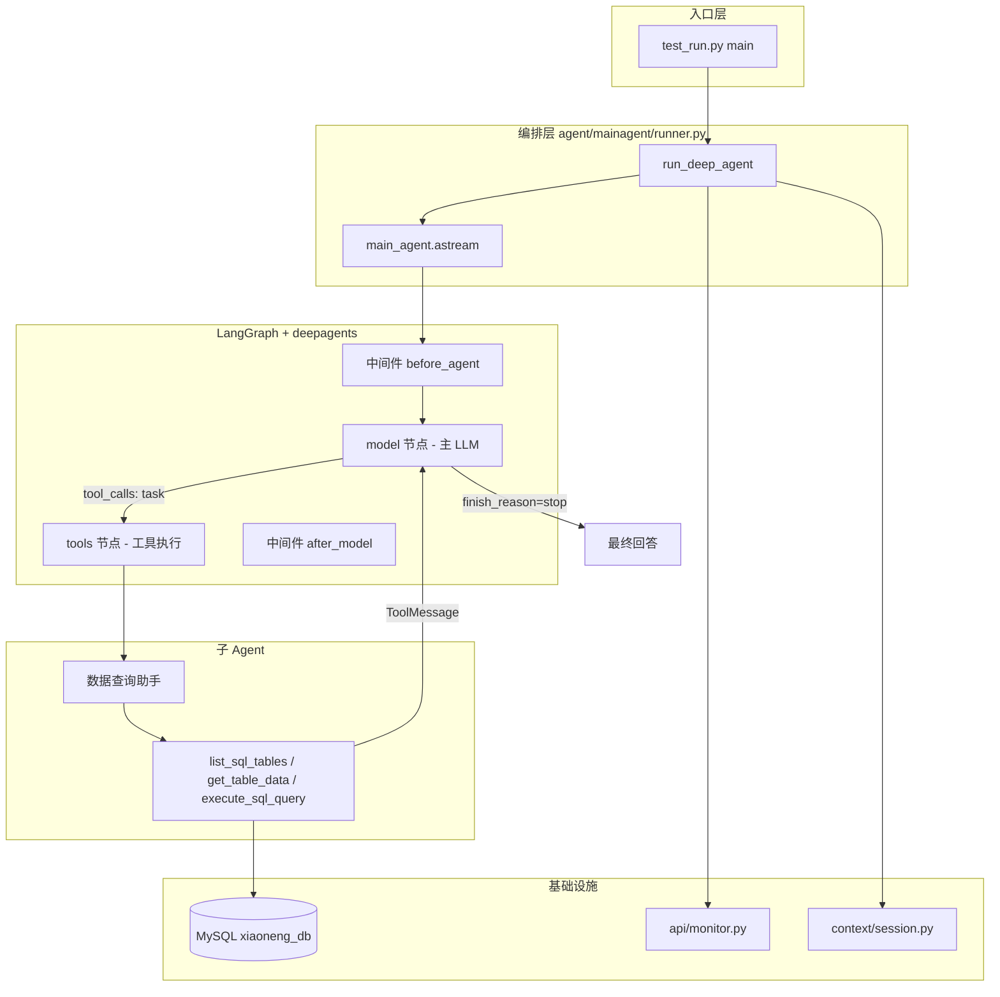
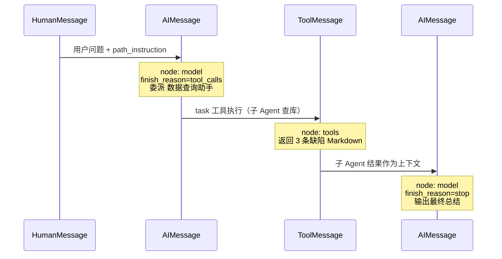

# 程序执行日志分析：大模型 Agent 如何工作

本文以一次**真实成功运行**的日志为线索，逐段对照源码，说明本项目中多 Agent 系统的完整执行链路。

**示例任务**：查询 `xiaoneng_db` 中 Sprint-12 迭代的开放缺陷并简要总结。

**入口命令**（IDEA Debug）：

```text
.venv\Scripts\python.exe agent\test_run.py
```

---

## 1. 整体架构



**核心思想**：

| 角色 | 职责 |
|------|------|
| **主 Agent（效能负责人）** | 理解用户意图、规划步骤、委派子 Agent、汇总最终答案 |
| **子 Agent（数据查询助手）** | 在独立上下文中多次调用数据库工具，返回查数结果 |
| **LangGraph** | 以「图节点」方式驱动 `model → tools → model → ...` 循环 |
| **deepagents** | 在 LangGraph 上封装 `create_deep_agent`，提供 `task` 工具委派子 Agent |

---

## 2. 启动前：模块加载时发生了什么

在 `test_run.py` 执行 `main()` **之前**，Python 导入链已经组装好主 Agent。

### 2.1 加载 Prompt 与模型

```python
# agent/mainagent/runner.py（模块顶层，import 时执行）
_main_cfg = get_main_agent_prompt()      # 读 prompt/prompts.yml
model = get_model()                      # 读 config/settings.py + .env

main_agent = create_deep_agent(
    model=model,
    system_prompt=_main_cfg["system_prompt"],
    tools=[read_file_content],
    checkpointer=InMemorySaver(),
    subagents=ALL_SUBAGENTS,             # 5 个子 Agent
)
```

| 文件 | 作用 |
|------|------|
| `prompt/prompts.yml` | 主 Agent 与各子 Agent 的 `system_prompt`、`name`、`description` |
| `prompt/loader.py` | 校验 YAML 并返回配置 |
| `llm/model.py` | 初始化 `GLM-5`（或 `.env` 中配置的模型） |
| `agent/subagent/__init__.py` | 注册 5 个子 Agent，本次用到的是 `database_agent` |

主 Agent 的 system prompt 中写明了专家团队成员（摘自 `prompts.yml`）：

```yaml
你的专家团队成员：
  1. **数据查询助手** — 从 xiaoneng_db 查询需求、缺陷、迭代、工时等结构化数据
  2. **行业检索助手** — ...
  ...
```

因此当用户问「查 Sprint-12 开放缺陷」时，主 LLM 会优先委派 **数据查询助手**，而不是自己写 SQL。

---

## 3. 按时间线读执行日志

以下日志来自一次完整成功运行（`exit code 0`）。

---

### 阶段 0：程序入口

```text
Query: 请查询 xiaoneng_db 中 Sprint-12 迭代有哪些开放缺陷，并简要总结。
Session: cli-9444a046
```

**对应代码**：`agent/test_run.py`

```python
query = sys.argv[1] if len(sys.argv) > 1 else "请查询 xiaoneng_db 中 Sprint-12 ..."
session_id = f"cli-{uuid.uuid4().hex[:8]}"
await run_deep_agent(query, session_id)
```

| 变量 | 含义 |
|------|------|
| `query` | 用户自然语言任务 |
| `session_id` | 会话 ID，同时作为 LangGraph 的 `thread_id` 和工作目录后缀 |

---

### 阶段 1：会话准备

```text
task_query: 请查询 xiaoneng_db 中 Sprint-12 迭代有哪些开放缺陷，并简要总结。
session_id: cli-9444a046
session_dir: F:\...\output\session_cli-9444a046
session_dir_str: F:/.../output/session_cli-9444a046
relative_dir: output/session_cli-9444a046
upload_prompt: ''
uploaded_files: []
tokens: (Token(...), Token(...), Token(...), Token(...))
config: {'configurable': {'thread_id': 'cli-9444a046'}}
```

**对应代码**：`run_deep_agent()` 前半段 + `_prepare_session()`

```python
session_dir, session_dir_str, relative_dir, upload_prompt, uploaded_files = _prepare_session(session_id)
tokens = setup_request_context(session_dir_str, session_id)
config = {"configurable": {"thread_id": session_id}}
path_instruction = _build_path_instruction(relative_dir, upload_prompt)
user_content = task_query + path_instruction
```

**这一步在做什么**：

1. **建工作目录** `output/session_{id}/`，Agent 生成的报告会写到这里
2. **检查上传文件** `updated/session_{id}/`，有则复制到工作目录并追加 prompt
3. **设置 ContextVar**（`context/session.py`），让工具层能拿到当前会话目录和 thread_id
4. **拼 path_instruction**，告诉 LLM 文件读写规则（相对路径、禁止绝对路径等）

```text
[Monitor:session_created] 工作目录已创建: F:/.../output/session_cli-9444a046
```

**对应代码**：`monitor.report_session_dir(session_dir_str)` → `api/monitor.py` 的 `_emit("session_created", ...)`

---

### 阶段 2：注入用户消息，启动 Agent 图

```text
path_instruction:
    【工作环境指令】
    工作目录: output/session_cli-9444a046
    ...

input_messages: {'messages': [{'role': 'user', 'content': '请查询 xiaoneng_db...【工作环境指令】...'}]}
```

**对应代码**：

```python
async for chunk in main_agent.astream(input_messages, config=config):
```

送入图的状态只有一条 `HumanMessage`（用户消息 + 环境指令）。  
`config.thread_id` 让 `InMemorySaver` 能按会话隔离 checkpoint。

---

### 阶段 3：中间件预处理

```text
node_name: PatchToolCallsMiddleware.before_agent
state: {'messages': Overwrite(value=[HumanMessage(content="请查询 xiaoneng_db...")])}
```

| 字段 | 解读 |
|------|------|
| `node_name` | deepagents 内置中间件，在调模型前整理/修补 tool_calls |
| `HumanMessage` | LangChain 消息类型，表示用户输入 |
| `Overwrite(...)` | LangGraph 的状态更新方式，用新消息覆盖 messages |

**业务代码不直接写这个节点**，由 `create_deep_agent` 框架自动插入。看到它说明图已开始流转。

---

### 阶段 4：主 Agent 第一次调用 LLM —— 决定委派

```text
node_name: model
state: {'messages': [AIMessage(
  content='',
  tool_calls=[{
    'name': 'task',
    'args': {
      'description': '查询 xiaoneng_db 中 Sprint-12 迭代的开放缺陷。\n\n步骤：\n1. 先列出数据库中的表...',
      'subagent_type': '数据查询助手'
    }
  }],
  response_metadata={'finish_reason': 'tool_calls', 'model_name': 'GLM-5'}
)]}
```

**对应代码**：`runner.py` 中 `node_name == "model"` 分支

```python
if last_msg.tool_calls:
    for tool_call in last_msg.tool_calls:
        if name == "task":
            monitor.report_assistant(args.get("subagent_type", ""), ...)
```

**如何读这条 AIMessage**：

| 字段 | 值 | 含义 |
|------|-----|------|
| `content` | `''` | 这次模型不直接回答用户，而是选择行动 |
| `finish_reason` | `tool_calls` | 模型输出是工具调用，流程继续 |
| `name` | `task` | deepagents 的「委派子 Agent」工具 |
| `subagent_type` | `数据查询助手` | 匹配 `database_agent["name"]` |
| `description` | 多步查库说明 | 传给子 Agent 的任务描述 |

```text
[Monitor:assistant_call] 正在调用助手: 数据查询助手
tool_call_name: task
tool_call_args: {'description': '...', 'subagent_type': '数据查询助手'}
```

主 Agent **没有**直接连数据库，而是把查库任务交给子 Agent。这正是 `prompts.yml` 里「效能负责人协调专家」的设计。

**子 Agent 定义**（`agent/subagent/database_agent.py`）：

```python
database_agent = {
    "name": _cfg["name"],           # "数据查询助手"
    "description": _cfg["description"],
    "system_prompt": _cfg["system_prompt"],
    "tools": [list_sql_tables, get_table_data, execute_sql_query],
}
```

```text
node_name: TodoListMiddleware.after_model
state: None
```

框架中间件收尾，`state: None` 表示本步无新消息，可忽略。

---

### 阶段 5：子 Agent 执行数据库工具（ReAct 循环）

子 Agent 在 `tools` 节点内部运行，日志以 `[Tool]` 和 `[SQL Audit]` 形式打印。

#### 5.1 列表明细

```text
[Tool] list_sql_tables args={}
[SQL Audit] tool=list_sql_tables ms=190.8 size=108 status=ok query=SHOW TABLES
```

**对应代码**：`tools/db_tools.py`

```python
@tool
def list_sql_tables() -> str:
    hooks.report_tool("list_sql_tables")          # → [Tool] 日志
    ...
    cursor.execute("SHOW TABLES")
    _audit("list_sql_tables", "SHOW TABLES", ...)  # → [SQL Audit] 日志
```

子 Agent 按 `prompts.yml` 推荐流程：**先 list_sql_tables 了解库结构**。

#### 5.2 预览表结构

```text
[Tool] get_table_data args={'table_name': 'defects'}
[Tool] get_table_data args={'table_name': 'iterations'}
[SQL Audit] ... query=SELECT * FROM `defects` LIMIT 100
[SQL Audit] ... query=SELECT * FROM `iterations` LIMIT 100
```

**对应代码**：

```python
@tool
def get_table_data(table_name: str) -> str:
    hooks.report_tool("get_table_data", {"table_name": table_name})
    sql = f"SELECT * FROM `{table_name}` LIMIT 100"
```

子 Agent 从表数据推断字段含义（如 `iteration_code`、`status`）。

#### 5.3 执行精确 SQL

```text
[Tool] execute_sql_query args={'query': "
SELECT d.defect_id, d.defect_code, d.title, ...
FROM defects d
JOIN iterations i ON d.iteration_id = i.iteration_id
WHERE i.iteration_code = '2026-Sprint-12'
  AND d.status = 'open'
"}
[SQL Audit] tool=execute_sql_query ms=36.1 size=431 status=ok
```

子 Agent 又执行了：

- 带 `team_members` JOIN 的明细查询（补负责人姓名）
- `COUNT(*)` 统计总数
- `get_table_data(team_members)` 确认成员表结构

这是典型的 **ReAct（推理 + 行动）** 模式：

```text
观察（表列表）→ 行动（预览表）→ 观察（字段）→ 行动（写 SQL）→ 观察（结果）→ 行动（补全 JOIN）→ 完成
```

**安全机制**（`tools/sql_validator.py`）：

- `execute_sql_query` 仅允许只读 SQL（SELECT / SHOW / DESCRIBE）
- `get_table_data` 校验表名白名单
- 异常返回字符串而非抛错，避免打断 Agent 流程

---

### 阶段 6：工具结果返回主 Agent

```text
node_name: tools
state: {'messages': [ToolMessage(
  content='## Sprint-12 迭代开放缺陷查询结果\n\n### 开放缺陷明细（共 3 条）...',
  name='task',
  tool_call_id='call_78a82a0e4e7a4ed990f256e3'
)]}
tool_result_name: task
tool_result_content_preview: ## Sprint-12 迭代开放缺陷查询结果...
```

| 消息类型 | 含义 |
|----------|------|
| `ToolMessage` | 某次 `tool_calls` 的执行结果 |
| `name='task'` | 对应主 Agent 发起的 `task` 工具调用 |
| `tool_call_id` | 与 AIMessage 中的 `call_xxx` 一一对应 |

**对应代码**：`runner.py` 中 `node_name == "tools"` 分支打印预览。

子 Agent 返回的是**整理好的 Markdown 表格**（3 条开放缺陷、严重程度、负责人等），不是原始 CSV。子 Agent 的 system prompt 要求「返回完整查询结果，供后续分析使用」。

---

### 阶段 7：主 Agent 第二次调用 LLM —— 最终总结

```text
node_name: model
state: {'messages': [AIMessage(
  content='## Sprint-12 迭代开放缺陷总结\n\n**迭代概况**：...',
  tool_calls=[],
  response_metadata={'finish_reason': 'stop', 'model_name': 'GLM-5'}
)]}
```

| 字段 | 含义 |
|------|------|
| `content` 有值 | 给用户的最终自然语言回答 |
| `tool_calls=[]` | 不再调用工具 |
| `finish_reason: stop` | 模型认为任务完成 |

```text
主智能体执行结果，最终结果：## Sprint-12 迭代开放缺陷总结...
[Monitor:task_result] 任务执行完成
```

**对应代码**：

```python
elif last_msg.content:
    preview = content[:100]
    print(f"主智能体执行结果，最终结果：{preview}")
    monitor.report_task_result(content)
```

主 Agent 在子 Agent 原始数据基础上做了**业务向总结**：

- 强调 prod 环境缺陷需紧急处理
- 指出王浩负载集中
- 3 条缺陷均创建于同一天

这符合 `prompts.yml` 中「纯问答：只查数 → 汇总后直接回答」的任务类型。

---

### 阶段 8：收尾

```text
node_name: TodoListMiddleware.after_model
state: None
reset_all_tokens: (Token(...), ...)
Process finished with exit code 0
```

**对应代码**：

```python
finally:
    reset_all_tokens(tokens)   # 清理 ContextVar，防止污染下一个协程
```

---

## 4. Agent 循环模型（通用读日志法）

任意一次任务，LangGraph 大致按此循环运转：

```text
HumanMessage（用户输入）
    ↓
[before_agent 中间件]
    ↓
model（LLM 思考）
    ├─ finish_reason=tool_calls → tools（执行工具/子Agent）→ ToolMessage → 回到 model
    └─ finish_reason=stop       → 最终 AIMessage → 结束
    ↓
[after_model 中间件]
```

**本次任务的完整消息链**：

```text
HumanMessage(用户问题 + 环境指令)
  → AIMessage(tool_calls=[task → 数据查询助手])
  → [子Agent 内部多轮 Tool 调用]
  → ToolMessage(查库结果 Markdown)
  → AIMessage(最终总结, stop)
```

---

## 5. 日志前缀速查表

| 日志前缀 | 来源文件 | 说明 |
|----------|----------|------|
| `Query:` / `Session:` | `agent/test_run.py` | CLI 入口参数 |
| `task_query:` / `session_id:` / `config:` 等 | `agent/mainagent/runner.py` | 调试变量打印 |
| `[Monitor:session_created]` | `api/monitor.py` | 工作目录就绪 |
| `[Monitor:assistant_call]` | `api/monitor.py` | 主 Agent 委派子 Agent |
| `[Monitor:task_result]` | `api/monitor.py` | 任务完成 |
| `[Monitor:error]` | `api/monitor.py` | 异常（如 LLM Connection error） |
| `node_name:` / `state:` | `runner.py` astream 循环 | **Agent 图节点输出，调试核心** |
| `[Tool]` | `tools/hooks.py` | 某个 `@tool` 被调用 |
| `[SQL Audit]` | `tools/db_tools.py` | SQL 耗时、大小、状态 |
| `主智能体执行结果...` | `runner.py` | 最终回答前 100 字预览 |

---

## 6. 关键源码文件地图

```text
agent/test_run.py              # CLI 入口，生成 session_id，调用 run_deep_agent
agent/mainagent/runner.py      # 主 Agent 组装 + astream 循环 + 进度上报
agent/subagent/database_agent.py  # 数据查询子 Agent 配置
prompt/prompts.yml             # 主/子 Agent 的 system_prompt（决定行为）
prompt/loader.py               # 加载并校验 prompts.yml
llm/model.py                   # GLM-5 / OpenAI 兼容 API 客户端
tools/db_tools.py              # list_sql_tables / get_table_data / execute_sql_query
tools/hooks.py                 # [Tool] 日志钩子
tools/sql_validator.py         # SQL 只读校验
context/session.py             # 协程级 session_dir / thread_id
api/monitor.py                 # [Monitor:*] 进度事件
config/settings.py             # .env 配置（模型、MySQL 等）
```

---

## 7. 本次业务结果摘要

| 项目 | 值 |
|------|-----|
| 迭代编码 | `2026-Sprint-12`（名称 Agent，进行中） |
| 开放缺陷数 | 3 条 |
| Critical | BUG-2026-0122（session，test） |
| Major（prod） | BUG-2026-0123（trace_id，需优先） |
| Minor | BUG-2026-0121 |

---

## 8. 常见问题：从日志快速定位

| 现象 | 可能原因 | 查哪里 |
|------|----------|--------|
| 卡在第一个 `node_name: model` 后报错 | LLM API 连不上 | `.env` 的 `OPENAI_*`；`llm/model.py` 代理设置 |
| 有 `[Monitor:assistant_call]` 但无 `[Tool]` | 子 Agent 内部 LLM 失败 | 同上 |
| 有 `[Tool]` 但 `[SQL Audit] status=fail` | MySQL 配置或 SQL 校验失败 | `.env` 的 `MYSQL_*`；`sql_validator.py` |
| `finish_reason=tool_calls` 一直循环 | 模型认为任务未完成 | `prompts.yml` 是否引导过早结束 |
| `subagent_type` 选错助手 | 主 Agent 规划问题 | `prompts.yml` 的 `main_agent.system_prompt` |

---

## 9. 小结

本项目的 Agent 工作方式可以概括为：

1. **Prompt 驱动规划**：`prompts.yml` 定义主 Agent「效能负责人」和 5 个专家子 Agent 的能力边界。
2. **图驱动执行**：`create_deep_agent` + LangGraph 以 `model ↔ tools` 循环推进任务。
3. **委派而非直连**：主 Agent 通过 `task` 工具把查库交给「数据查询助手」，子 Agent 再 ReAct 式调用 `db_tools`。
4. **可观测**：`runner.py` 打印图节点状态；`hooks` / `db_tools` / `monitor` 分层打点。
5. **会话隔离**：`session_id` 同时用于工作目录、`thread_id` checkpoint、ContextVar 上下文。

读懂日志的关键：**先看 `node_name` 判断在哪个图节点，再看 `messages` 最后一条的消息类型（Human / AI / Tool）和 `finish_reason`。**

---

## 10. astream 变更记录：nodeName × message × content

本节按 `main_agent.astream()` **每次 yield 一个 chunk** 的顺序，记录图中 `node_name`、新增/更新的 `message` 类型与 `content` 变化，便于一眼看清 stream 流程。

> 说明：`astream` 每次只输出**当前节点**的增量状态，`state["messages"]` 里通常是**本步新增的那一条消息**（`last_msg`），不是完整对话历史。完整历史由 LangGraph checkpoint（`InMemorySaver` + `thread_id`）在内部维护。

### 10.1 主图 stream 逐步变更表

| 步骤 | node_name | message 类型 | content / 关键字段 | 本步做了什么 |
|:----:|-----------|--------------|-------------------|--------------|
| 0 | —（astream 输入） | `HumanMessage` | `请查询 xiaoneng_db 中 Sprint-12 迭代有哪些开放缺陷，并简要总结。` + `【工作环境指令】...` | `runner.py` 构造 `input_messages`，用户任务与环境规则合并后送入图 |
| 1 | `PatchToolCallsMiddleware.before_agent` | `HumanMessage` | 同上（完整用户输入） | 框架中间件：整理消息格式，准备进入模型节点 |
| 2 | `model` | `AIMessage` | `content=''`（空）<br>`finish_reason=tool_calls`<br>`tool_calls=[{name:'task', subagent_type:'数据查询助手', description:'查询 Sprint-12 开放缺陷...'}]` | **主 LLM 第 1 次推理**：不直接回答，决定委派「数据查询助手」 |
| 3 | `TodoListMiddleware.after_model` | — | `state=None` | 框架中间件收尾，无新消息，可忽略 |
| 4 | `tools` | `ToolMessage` | `name='task'`<br>`content='## Sprint-12 迭代开放缺陷查询结果\n\n...共 3 条...'`<br>`tool_call_id='call_78a82a0e4e7a4ed990f256e3'` | **执行 `task` 工具**：启动子 Agent，查库完成后将 Markdown 结果作为工具返回值 |
| 5 | `model` | `AIMessage` | `content='## Sprint-12 迭代开放缺陷总结\n\n**迭代概况**：...'`<br>`finish_reason=stop`<br>`tool_calls=[]` | **主 LLM 第 2 次推理**：基于子 Agent 结果生成最终总结，任务结束 |
| 6 | `TodoListMiddleware.after_model` | — | `state=None` | 框架中间件收尾，流程结束 |

### 10.2 对话状态累积（逻辑上的 messages 链）

把各步新增消息串起来，等价于 checkpoint 中保存的完整对话：

```text
步骤 0~1  HumanMessage
          「请查询 Sprint-12 开放缺陷…」+ 工作环境指令

步骤 2    AIMessage (tool_calls)
          content: (空)
          → task(subagent_type=数据查询助手, description=查库步骤说明)

步骤 4    ToolMessage
          name: task
          content: ## Sprint-12 迭代开放缺陷查询结果 … 共 3 条 …

步骤 5    AIMessage (stop)
          content: ## Sprint-12 迭代开放缺陷总结 …
          tool_calls: (无)
```

用 Mermaid 表示消息追加顺序：



### 10.3 步骤 4（tools 节点）内部的子 Agent 动作

主图在步骤 4 只 yield **一条** `ToolMessage`，但子 Agent 内部经历了多轮「推理 → 调工具 → 观察结果」。这些动作体现在 `[Tool]` / `[SQL Audit]` 日志中，**不会**每条都作为主图的独立 `node_name` chunk 输出：

| 子步骤 | 工具名 | args 摘要 | 作用 |
|:------:|--------|-----------|------|
| 4.1 | `list_sql_tables` | `{}` | `SHOW TABLES`，了解库中有哪些表 |
| 4.2 | `get_table_data` | `table_name=defects` | 预览缺陷表字段 |
| 4.3 | `get_table_data` | `table_name=iterations` | 预览迭代表字段 |
| 4.4 | `execute_sql_query` | `JOIN defects + iterations`，`iteration_code='2026-Sprint-12'`，`status='open'` | 查开放缺陷明细 |
| 4.5 | `execute_sql_query` | 同上 + `LEFT JOIN team_members` | 补负责人、报告人姓名 |
| 4.6 | `execute_sql_query` | `COUNT(*)` | 统计开放缺陷总数 |
| 4.7 | `get_table_data` | `table_name=team_members` | 确认成员表结构 |
| 4.8 | （子 Agent 汇总） | — | 将多次 SQL 结果整理为 Markdown，封装为 `ToolMessage.content` 返回主 Agent |

### 10.4 与 `runner.py` 打印字段的对应关系

`astream` 循环里每次 chunk 会打印：

```python
print(f"node_name: {node_name}")
print(f"last_msg_type: {type(last_msg).__name__}")
print(f"last_msg: {last_msg}")
```

对照上表阅读：

| 你看到的打印 | 对应章节 |
|--------------|----------|
| `last_msg_type: HumanMessage` | 步骤 1 |
| `last_msg_type: AIMessage` + `tool_calls: [...]` | 步骤 2（主 Agent 委派） |
| `last_msg_type: ToolMessage` + `tool_result_name: task` | 步骤 4（子 Agent 查库结果） |
| `last_msg_type: AIMessage` + `tool_calls: []` + 有 `content` | 步骤 5（最终回答） |
| `state: None` | 步骤 3 / 6（中间件，跳过 `messages` 解析） |

### 10.5 快速判断：stream 进行到哪了？

```text
看到 node_name=model 且 tool_calls 非空     → 主 Agent 刚决定「去干活」（委派或调工具）
看到 [Tool] / [SQL Audit]                  → 正在 tools 节点内部执行（多半是子 Agent 查库）
看到 node_name=tools 且 ToolMessage        → 子 Agent 结果已回传，即将进入下一轮 model
看到 node_name=model 且 finish_reason=stop → 最终回答已生成，stream 即将结束
```

